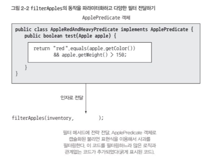
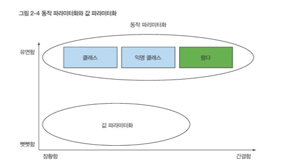

# Chapter 2 - 동작 파라미터화 코드 전달하기

동작 파라미터화를 이용하면 자주 바뀌는 요구사항에 효과적의로 대응할 수 있다. 동작 파라미터화란 아직은 어떻게 실행할 것인지 결정하지 않은 코드 블록을 의미한다. 

동작 파라미터화를 추가하려면 쓸데없는 코드가 늘어난다. 자바 8 은 람다 표현식으로 이 문제를 해결한다. 

### 2.1 변화하는 요구사항에 대응하기

2.1.1 첫번째 시도: 기존의 농장 재고목록 애플리케이션 리스트에서 녹색 사과만 필터링 하는 기능 추가

```java
public static List<Apple> filterGreenApples(List<Apple> inventory){
    List<Apple> result = new ArrayList<>();//사과 누적리스트
    for(Apple apple: inventory){
        if(GREEN.equals(apple.getColor()){ // 녹색 사과만 선택
            result.add(apple);    
        }    
    }
    return result;
}
```

2.1.2 두번째 시도: 색을 파라미터화

```java
public static List<Apple> filterApplesByColor(List<Apple> inventory,Color color){
    List<Apple> result = new ArrayList<>();//사과 누적리스트
    for(Apple apple: inventory){
        if(apple.getColor().equals(color)){ // 녹색 사과만 선택
            result.add(apple);    
        }    
    }
    return result;
}
```

2.1.3 세번째 시도: 가능한 모든 속성으로 필터링

```java
public static List<Apple> filterApplesByColor(List<Apple> inventory,Color color,int weihgt, boolean flag){
    List<Apple> result = new ArrayList<>();//사과 누적리스트
    for(Apple apple: inventory){
        if((flag&&apple.getColor.equals(color))||(!flag&&apple.getWeight()>weight)){
            result.add(apple);
        }
    }
    return result;
}
```

  → 형편없는 코드. true false가 의미하는 바가 명확하지 않으며 앞으로 요구사항이 바뀌었을 때 유연하게 대응 할 수도 없음. 

ex. 사과 크기, 모양, 출하지 등으로 사과를 필터링 하고 싶다면? 녹색 사과중에 무거운 사과를 필터링 하고 싶다면? 

filterApples에 어떤 기준으로 사과를 필터링할 것인지 효과적으로 전달할 수 있다면 좋을 것이다. 동작 파라미터화를 이용해 유연성을 얻는다. 

### 2.2 동작 파라미터화

프레디케이트(Predicate): 참 거짓을 반환하는 함수

선택조건을 정의하는 인터페이스를 정의 

```java
public interface ApplePredicate{
    boolean test (Apple apple); 
}

public class AppleHeavyWeihgtPredicate implements ApplePredicate{//무거운 사과만 선택
    public boolean test(Apple apple){
        return apple.getWeight()>150;
    }
}

public class AppleGreenColorPredicate implements ApplePredicate{//녹색 사과만 선택
    public boolean test(Apple apple){
        return GREEN.equals(apple.getColor());
    }
}
```


위 조건에 따라 filter 메서드가 다르게 동작할 것이라고 예상할 수 있다. 이를 전략 디자인패턴 strategy design pattern 이라고 한다. 전략디자인패턴은 각 알고리즘(전략)을 캡슐화하는 알고리즘 패밀리를 정의 해둔 다음에 런타임 알고리즘을 선택하는 기법. ApplePredicate가 알고리즘 패밀리, AppleHeavyWeightPredciate,..가 전략이다. 

### 2.2.1 네번째시도 : 추상적 조건으로 필터링

```java
public static List<Apple> filterApples(List<Apple> inventory,ApplePredicate p){
    List<Apple> result = new ArrayList<>();//사과 누적리스트
    for(Apple apple: inventory){
        if(p.test(apple){ //프레디케이트 객체로 사과 검사 조건을 캡슐화
            result.add(apple);    
        }    
    }
    return result;
}

public class AppleRedAndHeavyPredicate implements ApplePredicate{//레드, 무거운 사과선택
    public boolean test(Apple apple){
        return RED.equals(apple.getColor())
                        && apple.getWeight()>150;
    }
}

List<Apple> redAndHeavyApples = filterApples(inventory, new AppleRedAndHeavyPredicate());
```



### 2.3 복잡한 과정 간소화

2.3.1 익명클래스

자바는 클래스의 선언과 인스턴스화를 동시에 수행할 수 있도록 익명클래스 라는 기법을 제공한다.

2.3.2 다섯번째시도: 익명클래스 사용 

```java
List<Apple> redApples = filterApples(inventory, new ApplePredicate(){
    public boolean test(Apple apple){
        return RED.equals(apple.getColor());
    }
});
```

2.3.3 여섯번째 시도: 람다표현식 사용 

```java
List<Apple> result=
    filterApple(inventory, (Apple apple)->RED.equals(apple.getColor()));
```



2.3.4 일곱번째 시도: 리스트 형식으로 추상화 

```java
public interface Predicate<T>{
    boolean test(T t);
}

public static <T> List<T> filter(List<T> list, Predicate<T> p){//형식 파라미터 T
    List<T> result = new ArrayList<>();
    for(T e:list){
        if(p.test(e)){
            result.add(e);
        }    
    }
    return result; 
}

List<Apple> result=
    filter(inventory, (Apple apple)->RED.equals(apple.getColor()));

List<Integer> evenNumbers=filter(numbers, (Integer i)->i%2==0);
```

### 2.4 실전 예제

2.4.1 Comparator로  정렬하기 

```java
inventory.sort(new Comparator<Apple>(){
    public int compare(Apple a1, Apple a2){
        return a1.getWeight().compareTo(a2.getWeight());
    }
});

inventory.sort(
    (Apple a1, Apple a2)->a1.getWeight().compareTo(a2.getWeight()));
```

2.4.2 Runnable로 코드블록 실행하기

```java
Thread t = new Thread(()->System.out.println("Hello world"));
```

2.4.3 Callable을 결과로 반환하기 (Runnable의 업그레이드 버전)

```java
ExecutorService executorService = Executors.newCachedThreadPool();
Future<String> threadName = executorService.submit(new Callable<String>()){
    @Override
        public String call() throws Exception{
            return Thread.currentThread().getName();
        }
});

Future<String> threadName = executorService.submit(
                () -> Thread.currentThread().getName());
```