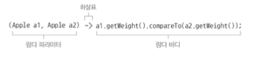
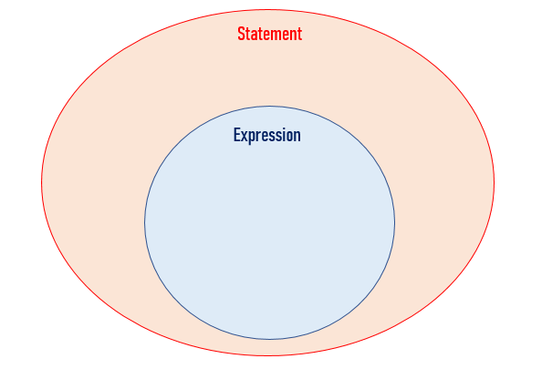

# Chapter 3 - 람다 표현식


- 람다표현식을 어떻게 만드는지, 어떻게 사용하는지, 어떻게 코드를 간결하게 만드는지
- 자바 8 API 에 추가된 중요 인터페이스와 형식 추론 등의 기능 확인
- 람다표현식과 함께 위력을 발휘하는 메서드 참조

### 3.1 람다란 무엇인가?

람다표현식: 메서드로 전달할 수 있는 익명 함수를 단순화한 것, 이름은 없지만, 파라미터 리스트, 바디, 반환 형식, 발생할 수 잇는 예외 리스트를 가질 수 있다.

람다의 특징 

- 익명: 보통의 메서드와 달리 이름이 없으므로 익명이라 표현
- 함수: 람다는 메서드처럼 특정 클래스에 종속되지 않으므로 함수라고 부른다. 하지만 메서드처럼 파라미터 리스트, 바디, 반환 형식, 가능한 예외 리스트를 포함한다.
- 전달: 람다표현식을 메서드 인수로 전달하거나 변수로 저장할 수 있다.
- 간결성: 익명 클래스처럼 많은 자질구레한 코드를 구현할 필요가 없다.

```java
Comparator<Apple> byWeight = new Comparator<Apple>(){
    public int comapre(Apple a1, Apple a2){
        return a1.getWeight().compareTo(a2.getWeight());
    }
}

////////람다를 이용한 코드
Comparator<Apple> byWeight = 
    (Apple a1, Apple a2) ->a1.getWeight().compareTo(a2.getWeight());
```

람다표현식을 이용하면 compare 메서드의 바디를 직접 전달하는 것처럼 코드를 전달할 수 있다. 



- 파라미터 리스트: Comparator의 compare 메서드 파라미터(사과 두 개)
- 화살표: 화살표(→)는 람다의 파라미터 리스트와 바디를 구분
- 

```java
(String s)-> s.length()

(Apple a)-> a.getWeight()>150
//람다표현식에는 return이 함축되어 있으므로 return문을 명시적으로 사용하지 않아도 됨

(int x, int y)->{
    System.out.println("Result::");
    System.out.println(x+y);
}//람다표현식은 여러행의 문장을 포함할 수 있다. 

()->42 //파라미터가 없으면 int42를 반환

(Apple a1, Apple a2) ->a1.getWeight().compareTo(a2.getWeight());
```

람다의 기본 문법

- (parameters)→expression
- (parameters)→{statements;}

<aside>
💡 expression vs statements

- expression: 식 혹은 표현식 , 값, 변수, 연산자 조합, 하나의 값으로 수렴하는 코드 조각 (하나의 단일값으로 평가될 수 있다.)
- statements: 실행 가능한 최소의 독립적인 코드 조각, 컴파일러가 이해하고 실행할 수 있는 모든 구문, 함수 선언, 제어문(if, switch, 반복문, …)이 이에 해당한다.

```java
int age = 14; //statement
age++; // expression && statement
age; // expression
2+2; // expression
```



</aside>

### 3.2 어디에, 어떻게 람다를 사용할까?

3.2.1 함수형 인터페이스 

함수형 인터페이스는 정확히 하나의 추상 메서드를 지정하는 인터페이스 이다. Comparator, Runnable 등이 있다. 

```java
public interface Comparator<T>{
    int compare(T o1, T o2);
}
public interface Runnable{
    void run()
}
```

람다표현식으로 함수형 인터페이스의 추상 메서드 구현을 직접 전달할 수 있으므로 전체 표현식을 함수형 인터페이스의 인스턴스로 취급할 수 있다. 

3.2.2 함수 디스크립터 

함수형 인터페이스의 추상 메서드 시그니처는 람다 표현식의 시그니처를 가리킨다. 람다 표현식의 시그니처를 서술하는 메서드를 함수 디스크립터 라고 부른다. 예를 들어 Runnable 인터페이스의 유일한 추상메서드 run은 인수와 반환값이 없으므로 Runnable 인터페이스는 인수와 반환값이 없는 시그니처로 생각할 수 있다. 

<aside>
💡 메서드 시그니처(Method signature)
자바 프로그래밍 언어에서 메서드 시그니처는 **메서드 명과 파라미터의 순서, 타입, 개수**를 의미한다.

리턴 타입과 exceptions는 메서드 시그니처가 아니다.

```java
public void funcA(int x, int y){    ...} 
// funcA(int,int)
public void funcA(double x, int y, double z){    ...}
// funcA(double,int,double)
```

메서드 이름과 매개변수 리스트가 중요한 이유는 오버로딩때문이다.

Java 컴파일러가 오버로딩된 함수를 메서드 시그니처를 통해서 구별한다.

</aside>

```java
process(()->System.out.println("This is awesome"));

process(()->{System.out.println("This is awesome");});

//한 개의 void 메소드 호출은 중괄호로 감쌀 필요가 없다. 
```

@FunctionalInterface 

함수형 인터페이스임을 가리키는 어노테이션

@FunctionalInterface로 인터페이스를 선언했지만 실제로 함수형 인터페이스가 아니면 컴파일 에러를 발생시킨다. ex. 추상메서드 1개이상 → 에러 발생 

### 3.3 람다 활용 : 실행 어라운드 패턴

```java
public String processFile() throws IOException{
    try (BufferedReader br = 
                new BufferedReader(new FileReader("data.txt"))){
                    return br.readLine(); //실제 필요한 작업을 하는 행 
    }
}
```

3.3.1 1단계 : 동작 파라미터화를 기억하라

한번에 두줄을 읽거나 가장 자주 사용되는 단어 반환, 정리과정은 재사용하고 processFile 메서드만 다른 동작을 수행하도록 명령할 수 있다면 좋음 → processFile 동작 파라미터화 

```java
String result = processFile((BufferedReader br)-> br.readLine()+br.readLIne());
```

3.3.2 2단계: 함수형 인터페이스를 이용해서 동작전달

함수형 인터페이스 자리에 람다를 사용 

```java
@FunctionalInterface
public interface BufferedReaderProcessor{
    String process(BuffredReader b) throws IOException;
} 

public String processFile(BufferedReaderProcessor p) throws IOException{...}
```

3.3.3 3단계: 동작실행

```java
public String processFile(BufferedReaderProcessor p) throws IOException{
    try(BufferedReader br = new BufferedReader(new FileReader("data.txt"))){
            return p.process(br);//BufferedReader 객체 자리 
    }
}
```

3.3.3 4단계: 람다 전달

```java
String oneLine = processFile((BufferedReader br)->br.readLine());
String twoLines = processFile((BufferedReader br)->br.readLine()+br.readLine());
```

### 3.4 함수형 인터페이스 사용

3.4.1 Predicate

java.util.function.Predicate<T> 인테페이스는 test라는 추상 메서드를 정의하며 test는 제네릭 형식 T의 객체를 인수로 받아 boolean을 반환 

```java
@FunctionalInterface
public interface Predicate<T>{
    boolean test(T t);
}

public <T> List<T> filter(List<T> list, Predicate<T> p){
    List<T> results = new ArrayList<>();
    for(T t:list){
        if(p.test(t)){
            results.add(t);
        }
    }
    return results;
}
Predicate<String> nonEmptyStringPredicate = (String s)-> !s.isEmpty();
LIst<String> nonEmpty= filter(listOfStrings, nonEmptyStringPredicate);
```

3.4.2 Consumer

java.util.function.Consumer<T> 인터페이스는 제네릭 T 객체를 받아서 void를 반환하는 accept 추상 메서드 정의 

```java
@FunctionalInterface
public interface Consumer<T>{
    void accept(T t);
}

public <T> void forEach(List<T> list, Consumer<T> c){
    for(T t:list){
        c.accpet(t);
    }
}
forEach(
    Arrays.asList(1,2,3,4,5),
    (Integer i)->System.out.println(i)//Consumer의 accept 메서드를 구현하는 람다식
)
```

3.4.3 Function

java.util.function.Function<T,R> 인터페이스는 제네릭 T 객체를 받아서 제네릭 R를 반환하는 apply 추상 메서드 정의 

```java
@FunctionalInterface
public interface Function<T,R>{
    R apply(T t);
}

public <T,R> List<R> map(List<T> list,Function<T,R> f){
    List<T> results = new ArrayList<>();
    for(T t:list){
        result.add(f.apply(t));
    }
    return result;
}
List<Integer> l =map(
    Arrays.asList("lambdas","in","action"),
    (String s)->s.length()//Fucntion의 apply 매서드를 구현하는 람다 
)
```

**기본형 특화**

박싱: 기본형을 참조형으로 변환

언박싱: 참조형을 기본형으로 변환

오토박싱: 박싱과 언박싱이 자동으로 이루어짐 

### 3.5 형식 검사, 형식 추론, 제약

3.5.1 형식 검사

람다가 사용되는 콘텍스트를 이용해서 람다의 형식을 추론할 수 있다. 어떤 콘텍스트에서 기대되는 람다 표현식의 형식을 대상 형식이라고 부른다. 

```java
List<Apple> result=filter(inventory,(Apple apple)->apple.getWeight() > 150);
```

1. filter 메서드의 선언을 확인
2. filter 메서드는 두번째 파라미터로 Predicate<Apple> 형식(대상 형식)을 기대한다.
3. Predicate<Apple> 은 test라는 한개의 추상 메서드를 정의하는 함수형 인터페이스다.
4. test 메서드는 Apple을 받아 boolean을 반환하는 함수 디스크럽터를 묘사
5. filter 메서드로 전달된 인수는 이와 같은 요구 사항을 만족해야한다. 

3.5.2 같은 람다, 다른 함수형 인터페이스

대상 형식(target typing)이라는 특징 때문에 같은 람다 표현식이더라도 호환되는 추상 메서드를 가진 다른 함수형 인터페이스로 사용될 수 있다. 

java

```java
Callable<Integer> c = ()->42; // 대상형식 Callable<Integer>
PrivilegedAction<Integer> p = ()->42; //대상형식 PrivilegedAction<Integer>
```

3.5.3 형식추론 

컴파일러는 람다표현식의 파라미터 형식에 접근할 수 있으므로 람다 문법에서 이를 생략할 수 있다. 

```java
Comparator<Apple> c = (Apple a1, Apple a2) -> a1.getWeight().compareTo(a2.getWeight());// 형식 추론을 하지 않음

Comparator<Apple> c = (a1, a2) -> a1.getWeight().compareTo(a2.getWeight());// 형식 추론 Apple 생략 
```

3.5.4 지역변수 사용

람다 표현식에서는 익명함수가 하는 것처럼 자유변수(free variable, 파라미터로 넘겨진 변수가 아닌 외부에서 정의된 변수)를 활용, 이를 람다캡처링이라고 부름

```java
int portNumber = 1337;
Runnable r1 = () -> System.out.println(portNumber); // 자율변수를 활용
portNumber=31337; // error: 람다에서 참고하는 지역변수는 final로 선언되거나 실질적으로 final처럼 취급되어야 한다.
```

인스턴스 변수는 힙에 저장, 지역변수는 스택에 위치, 람다에서 지역변수를 바로 접근할 수 있다는 가정하에 람다가 스레드에서 실행된다면 변수를 할당한 스레드가 사라져서 변수 할당이 해제되었는데도 람다를 실행하는 스레드에서 해당 변수에 접근하려 할 수 있다. 따라서 자바 구현에서는 원래 변수에 접근을 허용 하는것이 아니라 **자유 지역 변수의 복사본을 제공**한다. 따라서 복사본의 값이 바뀌지 않아야 하므로 지역 변수에는 한 번만 값을 할당해야 한다는 제약이 생긴것이다. 

### 3.6 메서드 참조

```java
inventory.sort((Apple a1, Apple a2) -> a1.getWeight().compareTo(a2.getWeight()));

inventory.sort(Comparator.comparing(Apple::getWeight)) //메서드 참조
```

3.6.1 요약 

명시적으로 메서드명을 참조함으로써 가독성을 높임 

활용방법: 메서드명 앞에 구분자(::)을 붙이는 방식 

1. 정적 메서드 참조 
   
    ex. Integer의 parseInt 메소드 , Integer::parseInt

2. 다양한 형식의 인스턴스 메서드 참조
   
    ex. String의 length 메소드 , String::length

3. 기존 객체의 인스턴스 메서드 참조 
   
    ex. Transaciton객체를 할당받은 expensiveTransaction 지역변수와 Transaciton 의 getValue 메소드 , expensiveTransaction::getValue

3.6.2 생성자 참조

ClassName::new 처럼 클래스명과 new 키워드를 이용해서 기존 생성자의 참조를 만들 수 있다. 

```java
Supplier<Apple> c1 = Apple::new;

Supplier<Apple> c1 = () -> new Apple();

Static Map<String, Function<Integer, Fruit>> map = new HashMap<>();
static{
    map.put("apple",Apple::new);
    map.put("orange",Orange::new);
}//map에 응용
```

### 3.7 람다, 메서드 참조 활용하기

```java
import static java.util.Comparator.comparing;
inventory.sort(comparing(apple->apple.getWeight()));
```

### 3.8 람다 표현식을 조합할 수 있는 유용한 메서드

디폴트 메서드(추상 메서드가 아니므로 함수형 인터페이스의 정의를 벗어나지 않음): 함수형 인터페이스에서 추가로 제공하는 메서드

3.8.1 Comparator 조합

```java
//역정렬
inventory.sort(Comparator.comparing(Apple::getWeight).reversed());
//thenComparing
inventory.sort(Comparator.comparing(Apple::getWeight)
        .reversed()
        .thenComparing(Apple::getCountry)); // 두 사과의 무게가 같으면 국가별로 정렬
```

3.8.2 Predicate 조합

```java
Predicate<Apple> notRedApple = redApple.negate();
// 기존 프레디케이트 객체 redApple의 결과를 반전시킨 객체 생성

Predicate<Apple> redAndHeavyApple = redApple
            .and(apple -> apple.getWeight() > 150);
// 빨간색이면서 무거운 사과 
// 두 프레디케이트를 연결해서 새로운 프레디케이트 객체를 만든다

Predicate<Apple> redAndHeavyAppleOrGreen = redApple
            .and(apple -> apple.getWeight() > 150)
            .or(apple->GREEN.equals(a.getColor()));
// 빨간색이면서 무거운 사과 또는 녹색 사과 
// 프레디케이트 메서드를 연결해서 더 복잡한 프레디케이트 객체를 만든다 
```