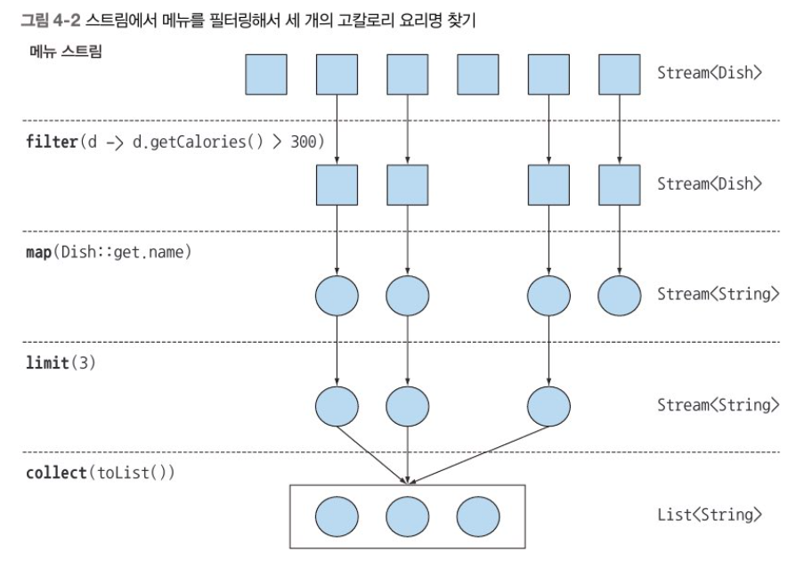
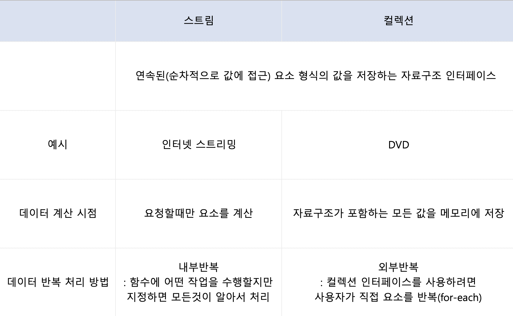
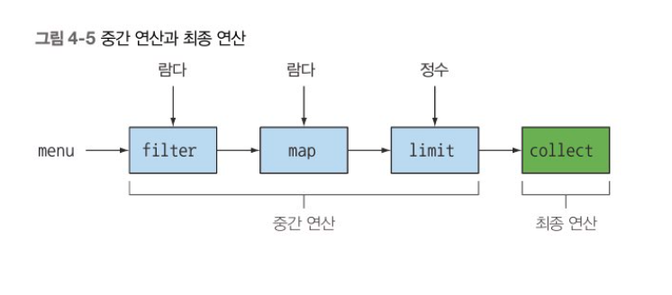
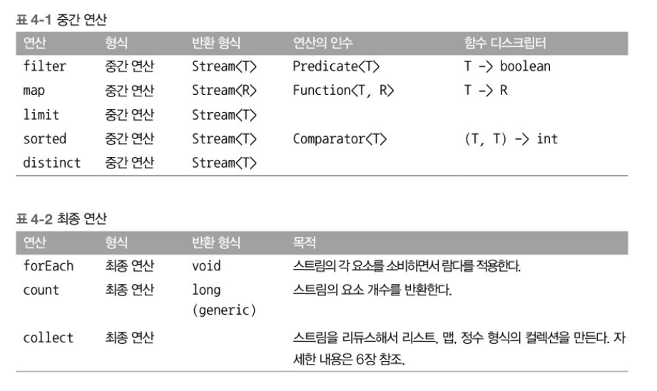

# Chapter 4 - 스트림 소개

### 4.1 스트림이란 무엇인가?

선언형(데이터를 처리하는 임시 구현 코드 대신 질의로 표현)으로 컬렉션 데이터를 처리할 수 있다. 

멀티스레드 코드를 구현하지 않아도 데이터를 투명하게 병렬로 처리할 수 있다.

```java
List<Dish> lowCaloricDishes = new ArrayList<>();
  for (Dish dish : menu) {//누적자로 요소 필터링 
    if (dish.getCalories() < 400) {
      lowCaloricDishes.add(dish);
    }
  }

Collections.sort(lowCaloricDishes, new Comparator<Dish>() {//익명클래스로 요리 정렬 
  public int compare(Dish dish1, Dish dish2) {
     return Integer.compare(dish1.getCalories(), dish2.getCalories());
  }
 });
List<String> lowCaloricDishesName = new ArrayList<>();
//lowCaloricDishesName는 컨테이너 역할만 하는 중간 변수
for (Dish d : lowCaloricDishes) {
 lowCaloricDishesName.add(d.getName());
}
```

```java
import static java.util.Comparator.comparing;
import static javja.util.stream.Collectors.toList;
List<String> lowCaloricDishesName=
    menu.stream()
                    .filter(d -> d.getCalories() < 400) //400칼로리 이하 요리 선택
                .sorted(comparing(Dish::getCalories))//칼로리로 요리 정렬
                .map(Dish::getName)//요리명 추출
                .collect(toList());//모든 요리명을 리스트에 저장

List<String> lowCaloricDishesName=
    menu.parallelStream()
                    .filter(d -> d.getCalories() < 400) //400칼로리 이하 요리 선택
                .sorted(comparing(Dish::getCalories))//칼로리로 요리 정렬
                .map(Dish::getName)//요리명 추출
                .collect(toList());//모든 요리명을 리스트에 저장
//parallelStream을 사용하여 멀티코어 아키텍처에서 병렬로 실행할 수 있다. 
```

parallelStream에 대한 자세한 설명은 7장에, 일단은 스트림의 새로운 기능이 소프트웨어 공학적으로 다음의 다양한 이득을 준다는 사실만 기억

- 선언형으로 코드를 구현 할 수 있다. 루프와 if문 필요 없음. 선언형 코드와 동작 파라미터화를 활용하면 변하는 요구사항에 쉽게 대응할 수 있다.
- filter, sorted, map, collect 같은 여러 빌딩 블록 연산은 연결해서 복잡한 데이터 처리 파이프라인을 만들 수 있다. 가독성과 명확성이 유지

자바8의 스트림 API의 특징

- 선언형: 더 간결하고 가독성이 좋아진다.
- 조립할 수 있음: 유연성이 좋아진다
- 병렬화: 성능이 좋아진다.

```java
public class Dish {

  private final String name;
  private final boolean vegetarian;
  private final int calories;
  private final Type type;

  public Dish(String name, boolean vegetarian, int calories, Type type) {
    this.name = name;
    this.vegetarian = vegetarian;
    this.calories = calories;
    this.type = type;
  }

  public String getName() {
    return name;
  }

  public boolean isVegetarian() {
    return vegetarian;
  }

  public int getCalories() {
    return calories;
  }

  public Type getType() {
    return type;
  }

  public enum Type {
    MEAT,
    FISH,
    OTHER
  }

  @Override
  public String toString() {
    return name;
  }

  public static final List<Dish> menu = Arrays.asList(
      new Dish("pork", false, 800, Dish.Type.MEAT),
      new Dish("beef", false, 700, Dish.Type.MEAT),
      new Dish("chicken", false, 400, Dish.Type.MEAT),
      new Dish("french fries", true, 530, Dish.Type.OTHER),
      new Dish("rice", true, 350, Dish.Type.OTHER),
      new Dish("season fruit", true, 120, Dish.Type.OTHER),
      new Dish("pizza", true, 550, Dish.Type.OTHER),
      new Dish("prawns", false, 400, Dish.Type.FISH),
      new Dish("salmon", false, 450, Dish.Type.FISH)
  );

}
```

### 4.2 스트림 시작하기

스트림이란 정확히 뭘까?

**스트림이란 데이터 처리 연산을 지원하도록 소스에서 추출된 연속된 요소**

- 연속된 요소: 컬렉션과 마찬가지로 스트림은 특정 요소 형식으로 이루어진 연속된 값 집합의 인터페이스를 제공한다. 컬렉션은 자료구조이므로 시간과 공간의 복잡성과 관련된 요소 저장 및 접근 연산이 주를 이룬다. 반면 스트림은 filter, sorted, map처럼 표현 계산식이 주를 이룬다. 즉 컬렉션의 주제는 데이터이고 스트림의 주제는 계산이다. 4.3절에서 둘이 차이점을 더 자세히 살펴본다.
- 소스: 스트림은 컬력션, 배열, I/O 자원 등의 데이터 제공 소스로 부터 데이터를 소비한다. 정렬된 컬렉션으로 스트림을 생성하면 정렬이 그대로 유지된다. 즉, 리스트로 스트림을 만들면 스트림의 요소는 리스트의 요소와 같은 순서를 유지한다.
- 데이터 처리 연산: 스트림은 함수형 프로그래밍 언어에서 일반적으로 지원하는 연산과 데이터베이스와 비슷한 연산을 지원한다. (ex. filter, map, reduce, find, match, sort) 등으로 데이터를 조작할 수 있다. 스트림 여산은 순차적으로 또는 병렬로 실행할 수 있다.
- 파이프라이닝: 대부분의 스트림 연산은 스트림 연산끼리 연결해서 커다란 파이프 라인을 구성할 수 있도록 스트림 자신을 반환한다. 덕분에 게으름, 쇼트서킷 같은 최적화도 얻을 수 있다.(5장에서 설명)
- 내부 반복: 반복자를 이용해서 명시적으로 반복하는 컬렉션과 달리 스트림은 내부 반복을 지원한다.

```java
List<String> threeHighCaloricDishNames=
    menu.stream() //메뉴에서 리스트를 얻는다
                    .filter(d -> d.getCalories() < 400) //400칼로리 이하 요리 선택
                .sorted(comparing(Dish::getCalories))//칼로리로 요리 정렬
                .map(Dish::getName)//요리명 추출
                .collect(toList());//모든 요리명을 리스트에 저장
```

여기서 데이터소스는 요리 리스트(메뉴)이다. 데이터 소스는 연속된 요소를 스트림에 제공한다. 다음으로 스트림에 filter, map, limit, collect 로 이어지는 일련의 데이터 처리 연산을 적용한다. collect를 제외한 모든 연산은 서로 파이프라인을 형성할 수 있도록 스트림을 반환한다. 마지막 collect 연산으로 파이프라인을 처리해서 결과를 바환, 마지막에 collect를 호출하기 전까지는 menu에서 무엇도 선택되지 않으며 출력 결과도 없다. 



### 4.3 스트림과 컬렉션

스트림과 컬렉션은 연속된(순차적으로 값에 접근) 요소 형식의 값을 저장하는 자료구조 인터페이스를 제공한다. 

스트림: 인터넷 스트리밍 비디오 시청, 사용자가 요청할 때만 요소를 계산(요청 중심 제조, 즉석 제조), 게으른 생성

컬렉션: DVD, 자료구조가 포함하는 모든 값을 메모리에 저장(생산자 중심:팔기도전에 창고를 가득 채움 ),적극적 생성 

4.3.1 딱 한번만 탐색할 수 있다. 

반복자와 마찬가지로 스트림도 딱 한번만 탐색할 수 있다. 탐색된 스트림의 요소는 소비된다. 한 번 탐색한 요소를 다시 탐색하려면 초기 데이터 소스에서 새로운 스트림을 만들어야한다.

4.3.2 외부 반복과 내부 반복 

외부 반복: 컬렉션 인터페이스를 사용하려면 사용자가 직접 요소를 반복해야 한다. (for-each를 사용해서)

내부반복: 함수에 어떤 작업을 수행할지만 지정하면 모든것이 알아서 처리된다. 

```java
//외부 반복
for(Dish dish:menu){//메뉴 리스트를 명시적으로 순차 반복
    name.add(dish.getName());//이름을 추출해서 리스트에 추가    
}

//내부 반복
List<String> names= menu.stream()
                                        .map(Dish::getName)//map메서드를 getName메서드로 파라미터화해서 요리명추출
                                        .collect(toList());//파이프라인 실행, 반복자 필요없음
```

내부반복을 이용하면 작업을 투명하게 병렬로 처리하거나 더 최적화된 다양한 순서로 처리할 수 있다. 또한 데이터 표현과 하드웨어를 활용한 병렬성 구현을 자동으로 선택한다.



### 4.4 스트림 연산

연결할 수 있는 스트림 연산을 **중간 연산** 이라고 하며, 스트림을 닫는 연산을 **최종 연산** 이라고 한다. 



```java
List<String> names=
                    menu.stream()//요리 리스트에서 스트림 열기
                    .filter(d -> d.getCalories() < 400) //중간연산
                .map(Dish::getName)//중간연산
                .collect(toList());//스트림을 리스트로 변환
```

- filter, map, limit은 서로 연결되어 파이프 라인을 형성한다.
- collect로 파이프라인을 실행한 다음에 닫는다.

4.4.1 중간연산 

중간 연산의 중요한 특징은 단말 연산을 스트림 파이프라인에 실행하기 전까지는 아무 연산도 수행하지 않는다는 것. 즉 게으르다 lazy 는 것, 중간 연산을 합친 다음에 합쳐진 중간 연산을 최종 연산으로 한 번에 처리하기 때문 

```java
List<String> names = menu.stream()
        .filter(dish -> {
          System.out.println("filtering: " + dish.getName());
          return dish.getCalories() > 300;
        })
        .map(dish -> {
          System.out.println("mapping: " + dish.getName());
          return dish.getName();
        })
        .limit(3)
        .collect(toList());
    System.out.println(names);

/**
filtering: pork
mapping: pork
filtering: beef
mapping: beef
filtering: chicken
mapping: chicken
[pork, beef, chicken]
**/
```

1. 300 칼로리가 넘는 요리는 여러 개지만 오직 처음 3개만 선택, limit연산 그리고 **쇼트서킷**이라 불리는 기법덕분(5장에서 자세히 설명)
2. filter, map은 서로 다른 연산이지만 한 과정으로 병합(**루프 퓨전**)

4.4.2 최종 연산 

최종 연산은 스트림 파이프라인에서 결과를 도출한다. 보통 최종 연산에 의해 List, Integer, void 등 스트림 이외의 결과가 반환된다. 

4.4.3 스트림 이용하기 

- 질의를 수행할(컬렉션 같은) 데이터 소스
- 스트림 파이프라인을 구성할 중간 연산 연결
- 스트림 파이프라인을 실행하고 결과를 만들 최종 연산

스트림 파이프라인의 개념은 빌터패턴과 비슷한다. 빌터패턴은 호출을 연결해서 설정을 만든다. (스트림의 중간연산) 그리고 준비된 설정에 build 메서드를 호출한다(스트림의 최종연산)

