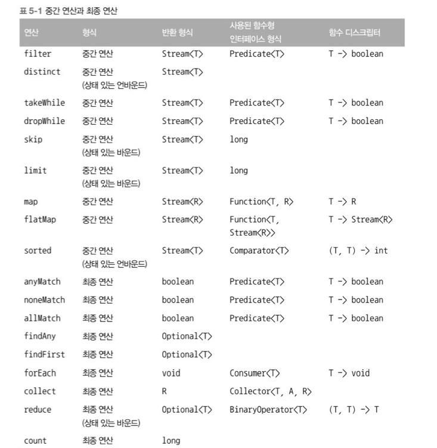

# Chapter 5 - 스트림 활용

명시적 반복 대신 filter와 collect 연산을 지원하는 스트림 API를 이용해서 데이터 컬렉션 반복을 내부적으로 처리할 수 있다. 

```java
import static java.util.stream.Collectors.toList;
List<Dish> vegetarianDished = 
            menu.steam()
                    .filter(Dish::isVegetarian)//필터링 연산을 인수로 넘겨줌 
                    .collect(toList());
```

### 5.1 필터링

```java
List<Dish> vegetarianMenu = menu.stream()
                                                                .fliter(Dish::isVegetarian)
                                                                .collect(toList());
```

5.1.1 프레디케이트(boolean을 반환하는 함수)로 필터링

5.1.2 고유 요소로 필터링 **distinct()**

```java
numbers.stream()
                .filter(i->i%2==0)
                .distinct()
                .forEach(System.out::printLn);
```

### 5.2 스트림 슬라이싱

5.2.1 프레디케이트를 이용한 슬라이싱

```java
List<Dish> filteredMenu
= specialMenu.stream()
                        .filter(dish->dish.getCalories()<320)
                        .collect(toList)); 
```

- TAKEWHILE

```java
List<Dish> filteredMenu
= specialMenu.stream()
                        .takewhile(dish->dish.getCalories()<320)
                        .collect(toList));
```

320칼로리보다 크거나 같은 요리가 나왔을 때 반복 작업을 중단 

- DROPWHILE

```java
List<Dish> filteredMenu
= specialMenu.stream()
                        .dropWhile(dish->dish.getCalories()<320)
                        .collect(toList));
```

takeWhile과 정반대 작업, 프레디케이트가 처음으로 거짓이 되는 지점까지 발견된 요소를 버림. 남은 요소를 반환 

5.2.2 스트림 축소 **limit()**

```java
List<Dish> dishes
= specialMenu.stream()
                        .filter(dish->dish.getCalories()<300)
                        .limit(3)
                        .collect(toList));
```

프레디케이트와 일치하는 처음 세 요소를 선택한 다음에 즉시 결과를 반환

정렬되지 않은 스트림(set)에서도 사용 가능, 소스가 정렬되어 있지 않았다면 결과도 정렬되지 않은 상태로 반환 

5.2.3 요소 건너뛰기 **skip()**

```java
List<Dish> dishes
= menu.stream()
                        .filter(dish->dish.getCalories()<300)
                        .skip(2)
                        .collect(toList));
```

skip(n): 처음 n개 요소를 제외한 스트림을 반환, n개 이하의 요소를 포함하는 스트림에 호출하면 빈 스트림이 반환 limit(n)과 skip(n)은 상호 보완적인 연산을 수행 

### 5.3 매핑

특정 객체에서 특정 데이터를 선택하는 작업

5.3.1 스트림의 각 요소에 함수 적용하기 

인수로 제공된 함수는 각 요소에 적용되며함수를 적용한 결과가 새로운 요소로 매핑

```java
List<Dish> dishNames
= menu.stream()
                        .map(Dish::getName)
                        .collect(toList));
//스트림의 요리명을 추출하는 코드 

List<Integer> dishNameLengths
= menu.stream()
                        .map(Dish::getName)
                        .map(String::length)
                        .collect(toList));
//각 요리명의 길이를 추출하는 코드 
```

5.3.2 스트림 평면화

리스트에서 고유 문자로 이루어진 리스트를 반환 

```java
words.stream()
            .map(word->word.split(""))
            .distinct()
            .collect(toList());
//잘못된 예시 Stream<String[]>을 반환 
```

- map과 [Arrays.stream](http://Arrays.stream) 활용

```java
words.stream()
            .map(word->word.split(""))//각 단어를 개별 문자열 배열로 반환 Stream<String[]>
            .map(Arrays::stream)//각 배열을 별도의 스트림으로 생성 List<Stream<String>>
            .distinct()
            .collect(toList());
//잘못된 예시 List<Stream<String>>을 반환 
```

- flatMap 사용

```java
words.stream()
            .map(word->word.split(""))//각 단어를 개별 문자열 배열로 반환 Stream<String[]>
            .flatMap(Arrays::stream)//생성된 스트림을 하나의 스트림으로 평면화 Stream<String>
            .distinct()
            .collect(toList());
//잘못된 예시 List<Stream<String>>을 반환 
```

### 5.4 검색과 매칭

5.4.1 프레디케이트가 적어도 한 요소와 일치하는지 확인 **anyMatch()**

```java
if(menu.stream().anyMatch(Dish::isVegetarian)){
        System.out.println("The menu is vegetarian friendly");
}
```

5.4.2 프레디케이트가 모든 요소와 일치하는지 검사 **allMatch() noneMatch()**

- 모든 요소가 주어진 프레디케이트 일치하는지 검사

```java
boolean isHealthy = menu.stream().allMatch(dish->dish.getCalories()<1000);
```

- 주어진 프레디케이트와 일치하는 요소가 없는지 확인

```java
boolean isHealthy = menu.stream().noneMatch(dish->dish.getCalories()>1000);
```

5.4.3 요소 검색 **findAny()**

```java
Optional<Dish> dish=
    menu.stream()
            .filter(Dish::isVegetarian)
            .findAny();
//임의의 요소 반환
```

Optional<T>클래스는 값의 존재나 부재 여부를 표현하는 컨테이너 클래스 

5.4.4 첫 번째 요소 찾기 **findFirst()**

### 5.5 리듀싱

리듀싱 연산: 모든 스트림 요소를 처리해서 값(Integer 형)으로 도출

5.5.1 요소의 합 0

```java
//1.
int sum=0;
for(int x : numbers){
    sum+=x;
}
//2.
int sum= numbers.stream().reduce(0,(a,b)->a+b);
//3.
int sum= numbers.stream().reduce(0,Integer::sum);
//4. 초기값이 없음, 합계가 없는 경우를 가리킬 수 있도록 Optional
Optional<Integer> sum= numbers.stream().reduce(0,(a,b)->a+b);
```

5.5.2 최댓값과 최솟값

```java
Optional<Integer> max = numbers.stream().reduce(Integer::max);
Optional<Integer> min = numbers.stream().reduce(Integer::min);
```

<aside>
💡 스트림 연산: 상태 없음과 상태 있음

map, filter 등은 입력 스트림에서 각 요소를 받아 0 또는 결과를 출력 스트림으로 보낸다. (사용자가 제고안 람다나 메서드 참조가 내부적인 가변 상태를 갖지 않는다는 가정하에) 보통 상태가 없는, 내부 상태를 갖지 않는 연산이다. 

하지만 reduce, sum, max 같은 연산은 결과를 누적할 내부 상태가 필요하다. 스트림에서 처리하는 요소 수와 관계 없이 내부 상태의 크기는 **한정** 되어 있다. 

반면 sorted, distinct 같은 연산은 스트림의 요소를 정렬하거나 중복을 제거하려면 과거의 이력을 알고 있어야한다. **모든 요소가 버퍼에 추가 되어 있어야 한다.** 연산을 수행하는 데 필요한 저장소 크기는 정해져있지 않으므로 데이터 스트림 크기가 크거나 무한이면 문제가 생긴다. 이러한 연산을 **내부 상태를 갖는 연산** 이라 한다.

</aside>



### 5.7 숫자형 스트림

5.7.1 기본형 특화 스트림 

박싱 비용을 피할 수 있도록 int, double, long 요소에 특화된 IntStream, DoubleStream, LongStream 을 제공한다. 각각의 인터페이스는 sum, max 같이 자주 사용하는 숫자 관련 리듀싱 연산 수행 메서드를 제공한다. 

1. 숫자 스트림으로 매핑 **mapToInt, mapToDouble, mapToLong**
   
   ```java
   int calories = menu.stream()//Stream<Dish>
                                       .mapToInt(Dish::getCalories)//IntStream
                                       .sum();
   ```

2. 객체 스트림으로 복원하기 

숫자 스트림을 만든 다음에, 원상태인 특화되지 않은 스트림으로 복원. 

IntStream은 기본형인 정수값만 만들 수 있다. IntStream의 map연산은 int를 받아서 int를 반환하는 람다(IntUnaryOperator)를 인수로 받는다. 하지만 정수가 아닌 Dish 같은 다른 값을 반환하고 싶다면 스트림 인터페이스에 정의된 일반적인 연산 사용

```java
IntStream intStream = menu.stream().mapToInt(Dish::getCalories);
//스트림을 숫자로 변환
Stream<Integer> stream= intStream.boxed();
//숫자 스트림을 스트림으로 변환 
```

기본값 : OptionalInt 

합계 예제에서는 0이라는 기본값이 있으나 최댓값에서는 0이라는 기본값 때문에 잘못된 결과가 도출될 수 있다. OptioanlInt를 이용해서 최댓값이 없는 상황에 사용할 기본값을 명시적으로 정의

```java
OptionalInt maxCalories = menu.stream()
                                                            .mapToInt(Dish::getCalories)
                                                            .max();
int max = maxCalories.orElse(1);//값이 없을 때 기본 최댓값을 명시적으로 설정
```

5.7.2 숫자 범위 

range, rangeClosed 첫 번째 인수로 시작값을, 두 번째 인수로 종료값을 갖는다. 

range는 시작값과 종료값이 결과에 포함되지 않고 rangeClosed는 결과에 포함됨 

```java
IntStream evenNumbers = IntStream.rangeClosed(1,100)//[1,100]
                                                                .filter(n->n%2==0);//1부터 100까지의 짝수 스트림 
```

5.7.3 숫자 스트림 활용: 피타고라스 수 

```java
Stream<double[]> pythagoreanTriple= 
    IntStream.rangeClosed(1,100).boxed()
                        .flatMap(a -> IntStream.rangeClosed(a,100)
                            .mapToObj(b -> new double[]{a,b,Math.sqrt(a*a,b*b)})
                            //만들어진 세수
                            .filter(t->t[2]%1==0)//세 수의 세번째 요소는 반드시 정수
                        );//1~100까지의 숫자 생성 스트림과 주어진 a를 이용한 세 수 스트림 들을 하나의 평준화된 스트림으로 만듦 
```

### 5.8 스트림 만들기

5.8.1 값으로 스트림 만들기 **Stream.of()**

```java
Stream<String> stream = Stream.of("Modern","Java","In","Action")

Stream<String> emptyStream = Stream.empty();//스트림을 비우는 함수 
```

5.8.2 null이 될 수 있는 객체로 스트림 만들기 **ofNullable**

```java
Stream<String> homeValueStream = Stream.ofNullable(System.getProperty("home"));
```

5.8.3 배열로 스트림 만들기 **Arrays.stream()**

```java
int[] numbers={2,3,4,5,6};
int sum = Arrays.stream(numbers).sum();
```

5.8.4 파일로 스트림 만들기 

5.8.5 함수로 무한 스트림 만들기 

크기가 고정되지 않은 스트림, 요청할때마다 주어진 함수를 이용해서 값을 만든다. 따라서 무제한으로 값 생성, 보통 무한한 값을 출력하지 않도록 limit(n) 사용

iterate는 요청할때마다 값을 생산할 수 있으며 끝이 없릉므로 무한스트림 생성, 이러한 스트림을 언바운드 스트림이라고 표현 

```java
System.iterate(0,n->n+2)
            .limit(10)
            .forEach(System.out::println);

Stream.iterate(new int[] {0,1},
                                t -> new int[]{t[1],t[0]+t[1]})
            .limit(10)
            .map(t->t[0])
            .forEach(System.out::println);
```

iterate메소드는 프레디케이트를 지원. filter은 사용 불가. filter 메소드는 언제 작업을 중단해야하는지 알 수 없기 때문, 대신 takeWhile을 사용

```java
IntStream.iterate(0,n->n<100,n->n+4)
                    .forEach(System.out::println);

IntStream.iterate(0,n->n+4)
                    .filter(n->n<100)    
                    .forEach(System.out::println);
//종료되지 않는 코드 

IntStream.iterate(0,n->n+4)
                    .takeWhile(n->n<100)    
                    .forEach(System.out::println);
```