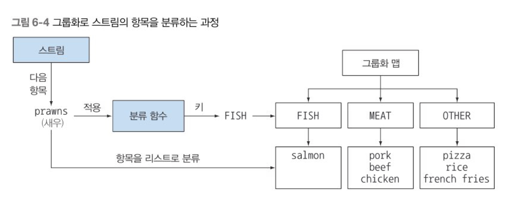

# Chapter 6 - 스트림으로 데이터 수집


### 6.1 컬렉터란 무엇인가?


훌륭하게 설계된 함수형 API의 또 다른 장점은 **높은 수준의 조합성과 재사용성**

collect로 결과를 수집하는 과정을 간단하면서도 유연한 방식으로 정의할 수 있음 


Collector 인터페이스의 메서드를 어떻게 구현하느냐에 따라서 스트림에 어떤 리듀싱 연산을 수행할지 결정됨 

Collectors 유틸리티 클래스는 자주 사용하는 컬렉터 인스터스를 손쇱게 생성할 수 있는 정적 팩토리 메서드를 제공 (ex. toList: 스트림의 모든 요소를 리스트로 수집)

```java
List<Transaction> transactions= transactionStream.collect(Collectors.toList());
```

6.1.2 미리 정의된 컬렉터 

Collectors에서 제공하는 메서드의 기능은 크게 세 가지로 구분할 수 있다. 

- 스트림 요소를 하나의 값으로 리듀스하고 요약
- 요소 그룹화
- 요소 분할

### 6.2 리듀싱과 요약

컬렉터로 스트림의 항목을 컬렉션으로 재구성할 수 있다. 일반적으로 말해 컬렉터로 스트림의 모든 항목을 하나의 결과로 합칠 수 있다.

```java
long howManyDishes = menu.stream().collect(Collectors.counting());

long howManyDishes = menu.stream().count();
```

6.2.1 스트림값에서 최댓값과 최솟값 검색 

Collectors.maxBy, Collectors.minBy 이용해서 스트림의 최댓값과 최솟값 계산할 수 있다. 

Comparator을 인수로 받음

```java
Comparator<Dish> dishCaloriesComparator= Comparator.comparingInt(Dish::getCalories);
//칼로리를 비교할 comparator 구현
Optional<Dish> mostCalorieDish= menu.stream().collect(maxBy(dishComparator));
```

스트림에 있는 객체의 숫자 필드의 합계나 평균 등을 반환하는 연산에도 리듀싱 기능이 자주 사용된다 이러한 연산을 **요약** 연산이라 부른다.

6.2.2 요약 연산 

Collectors.summingInt 요약 팩토리 메서드, 객체를 int로 매핑하는 함수를 인수로 받고 인수로 전달된 함수는 객체를 int로 매핑한 컬렉터를 반환한다. 그리고 summingInt가 collect 메서드로 전달되면 요약 작업을 수행한다. 

```java
int totalCalories = menu.stream().collect(summingInt(Dish::getCalories));
```


Collectors.summingLong과 summingDouble도 같은 방식으로 동작 

단순 합계 외에 평균값 계산 등의 연산도 요약 기능으로 제공(Collectors.averagingInt, averagingLong, averagingDouble) 

```java
double avgCalories = menu.stream().collect(averagingInt(Dish::getCalories)); 

IntSummaryStatistics menuStatistics = menu.stream().collect(summarizingInt(Dish::getCalories));
//IntSummaryStatistics(count=9,sum=4300,min=120,average=477,777778,max=800)
```

6.2.3 문자열 연결 

컬렉터에 joining 팩토리 메서드를 이용하면 스트림 각 객체에 toString 메서드를 호출해서 추출한 모든 문자열을 하나의 문자열로 연결해서 반환

```java
String shortMenu= menu.stream().map(Dish::getName).collect(joining());
String shortMenu=menu.stream().collect(joining());//Dish클래스가 toString을 포함하고 있다면 가능
//porkbeefchickenfrench fries ...
String shortMenu= menu.stream().map(Dish::getName).collect(joining(", "));
//pork, beef, chicken, french fries, ...
```

6.2.4 범용 리듀싱 요약 연산 

reducing 메서드로 만들어진 컬렉터 

```java
int totalCalories = menu.stream().collect(reducing(0,Dish::getCalories,(i,j)->i+j));
```

- 첫번째 인수는 리듀싱 연산의 시작값이거나 스트림에 인수가 없을 때 반환값
- 두번째 인수는 요리를 칼로리 정수로 변환할때 사용한 변환 함수
- 세번째 인수는 같은 종류의 두 항목을 하나의 값으로 더하는 BinaryOperator

```java
int totalCalories = menu.stream().collect(reducing(0,Dish::getCalories,Integer::sum);
```

**컬렉션 프레임워크 유연성: 같은 연산도 다양한 방식으로 수행할 수 있다.**


```java
int totalCalories = menu.stream().map(Dish::getCalories).reduce(Integer::sum).get
int totalCalories = menu.stream().mapToInt(Dish::getCalories).sum();
```

### 6.3 그룹화

```java
Map<Dish.Type, List<Dish>> dishesByType= menu.stream().collect(groupingBy(Dish::getType));
//{FISH=[prawns, salmon], OTHER=[french fries, rice, season fruit, pizza], ...}
```




 단순한 속성 접근자 대신 더 복잡한 분류 기준이 필요한 상황에서는 메서드 참조를 분류 함수로 사용할 수 없다. 예를 들어 400칼로리 이하를 ‘diet’로 400~700 을 ‘normal’로 700칼로리 초과를 ‘fat’으로 분류하다고 가정하자

```java
public enum CaloricLevel {DIET, NORMAL, FAT}
Map<CaloricLevel, List<Dish>> dishesByCaloricLevel= menu.stream().collect(
        groupingBy(dish->{
        if (dish.getCalories()<=400)return CaloricLevel.DIET;
        else if(dish.getCalories()<=700) return CaloricLevel.NORMAL;
        else return CaloricLevel.FAT;
}));
```

요리 종류와 칼로리 두가지 기준으로 동시에 그룹화 할 수 있는 방법은?

6.3.1 그룹화된 요소 조작 

요소를 그룹화한 다음 각 결과 그룹의 요소를 조작하는 연산이 필요 

```java
Map<Dish.Type, List<Dish>> caloricDishesByType=
        menu.stream().filter(dish->dish.getCalories()>500)
                                    .collect(groupingBy(Dish::getType));
//{OHTER=[french fries, pizza], MEAT=[pork, beef]}
```

필터를 만족하는 FISH 종류 요리가 없으므로 결과 맵에서 해당 키 자체가 사라짐 

→ 일반적인 분류 함수에 콜렉터 형식의 두 번째 인수를 갖도록 groupingBy 팩토리 메서드를 오버로드

```java
 Map<Dish.Type, List<Dish>> caloricDishesByType=
        menu.stream().collect(groupingBy(Dish::getType,filtering(dish->dish.getCalories()>500, toList())));
//{OHTER=[french fries, pizza], MEAT=[pork, beef], FISH=[]}
```

mapping 메서드: 매핑함수 와 각 항목에 적용한 함수를 모으는 데 사용

```java
 Map<Dish.Type, List<Dish>> dishNamesByType=
        menu.stream().collect(groupingBy(Dish::getType,mapping(Dish::getName,toList())));
//그룹의 각 요리를 관련 이름 목록으로 변환
```


```java
 Map<Dish.Type, Set<String>> dishNamesByType=
        menu.stream()
            .collect(groupingBy(Dish::getType,
                    flatMapping(dish->dishTags.get(dish.getName()).stream(),toSet()))));
//각 요리에서 태그리스트를 얻음 
//{MEAT=[salty,greasy,roasted,fried,crisp], FISH=[roasted,tasty,...]...}
```

6.3.2 다수준 그룹화 

두 인수를 받는 팩토리 메서드 Collectors.groupingBy를 이용해서 항목을 다수준으로 그룹화 할수 있다.

바깥쪽 groupingBy메서드에 스트림항목을 분류할 두번째 기준을 정의하는 내부 groupingBy를 전달

```java
Map<Dish.Type, Map<CaloricLevel, List<Dish>>> dishedByTypeAndCaloricLevel=
     menu.stream().collect(
        groupingBy(Dish::getType,//첫번째 수준의 분류 함수
            groupingBy((Dish dish) -> {//두번째 수준의 분류 함수 
              if (dish.getCalories() <= 400) {
                return CaloricLevel.DIET;
              }
              else if (dish.getCalories() <= 700) {
                return CaloricLevel.NORMAL;
              }
              else {
                return CaloricLevel.FAT;
              }
            })
        )
    );
//{MEAT={DIET=[chicken], NORMAL=[beef], FAT=[pork]}, FISH={DIET=[prawns],...}}
//외부맵은 첫번째에서 분류한 키 값fish meat other을 갖는다
//그리고 두번째에서 분류한 키 값 normal, diet, fat을 갖는다 
//두 수준의 맵은 첫 번째 키와 두 번째 키의 기준에 부합하는 요소 리스트 salmon, pizza.. 등을 값으로 갖는다.
```

다수준 그룹화 연산은 다양한 수준으로 확장할 수 있다. 즉 n 수준 그룹화의 결과는 n수준 트리 구조로 표현되는 n 수준 맵이 된다. 


6.3.3 서브그룹으로 데이터 수집 

첫번째 groupingBy로 넘겨주는 컬렉터의 형식은 제한이 없다 

```java
Map<Dish.Type, Long> typesCount=
   menu.stream().collect(groupingBy(Dish::getType, counting()));
//{MEAT=3, FISH=2, OTHER=4}
```

groupingBy(f)는 groupingBy(f, toList())의 축약형임 

```java
Map<Dish.Type, Optional<Dish>> mostCaloricyBType() =
    menu.stream().collect(
        groupingBy(Dish::getType,
            maxBy(comparingInt(Dish::getCalories)))));
 //{MEAT=Optional[pork], FISH=Optional[salmon], OTHER=Optional[pizza]}
```

**컬렉터 결과를 다른 형식에 적용하기 collectingAndThen**

```java
Map<Dish.Type,Dish>= mostCaloricByType=
    menu.stream()
                .collect(groupingBy(Dish::getType, //분류함수
            collectingAndThen(
                maxBy(comparingInt(Dish::getCalories)),//감싸인 컬렉터 
                Optional::get)));//변환 함수 

//{FISH=salmon, OTHER=pizza, MEAT=pork}
```

collectingAndThen 은 적용할 컬렉터와 변환 함수를 인수로 받아 다른 컬렉터를 반환한다. 반환되는 컬렉터는 기존 컬렉터의 래퍼역할을 하며 collect의 마지막 과정에서 변환 함수로 자신이 반환하는 값을 매핑한다. 


### 6.4 분할

분할은 분할 함수라 불리는 프레디케이트를 분류 함수로 사용하는 특수한 그룹화 기능으로 불리언을 반환 한다. 결과적으로 그룹화 맵은 최대 (참/거짓) 두 그룹으로 분류 된다. 

```java
Map<Boolean, List<Dish>> partitionedMenu() =
                 menu.stream().collect(partitioningBy(Dish::isVegetarian));
// {false=[pork, beef, chicken, prawns,...]
//. true =[french fries, rice, season fruit...]}
```

6.4.1 분할의 장점

분할 함수가 반환하는 참, 거짓 두가지 요소스트림 리스트를 모두 유지한다는 것이 분하르이 장점 

```java
Map<Boolean, Map<Dish.Type, List<Dish>>> vegetarianDishesByType() =menu.stream().
collect(
        partitioningBy(Dish::isVegetarian, //분할 함수
                                     groupingBy(Dish::getType))); // 두 번째 컬렉터 
  // {false={FISH=[prawns,salmon], MEAT=[pork, beef, chicken],
  //. true ={OTHER=[french fries, rice, season fruit,pizza]}}
```

각각의 그룹에서 가장 칼로리가 높은 요리 

```java
Map<Boolean, Dish> mostCaloricByVegetarian=
menu.stream().collect(
        partitioningBy(Dish::isVegetarian,
            collectingAndThen(maxBy(comparingInt(Dish::getCalories)),
                Optional::get)));
//{false=pork, true=pizza}
```

6.4.2 숫자를 소수와 비소수로 분할하기 

```java
public boolean isPrice(int candidate){
            int candidateRoot = (int) Math.sqrt((double)candidate);
            return IntStream.rangeClosed(2,candidateRoot)
                                                    .noneMatch(i->candidate%i==0;)
}//소수인지 판단하는 프레디케이트
public Map<Boolean, List<Integer>> partitionPrimes(int n){
        return IntStream.rangeClosed(2,n).boxed()
                                                .collect(
                                                        partitioningBy(candidate->isPrime(candidate)));
}
```

### 6.5 Collector 인터페이스

```
public interface Collector<T, A, R> {
    Supplier<A> supplier();
    BiConsumer<A, T> accumulator();
    BinaryOperator<A> combiner();
    Function<A, R> finisher();
    Set<Characteristics> characteristics();
}
```

- T는 수집될 스트림 항목의 제네릭 형식
- A는 누적자, 수집 과정에서 중간 결과를 누적하는 객체의 형식
- R은 수집 연산 결과 객체의 형식이다.

6.5.1 Collector 인터페이스의 메서드 

**supplier 메서드: 새로운 결과 컨테이너 만들기**

빈 결과로 이루어진 supplier를 반환

**accumulator 메서드: 결과 컨테이너에 요소 추가하기**

리듀싱 연산을 수행하는 함수를 반환, 스트림에서 n번째 요소를 탐색할 때 두 인수, 즉 누적자와 n번째 요소를 함수에 적용한다

**finisher 메서드: 최종 변환값을 결과 컨테이너로 적용하기**

스트림 탐색을 끝내고 누적자 객체를 최종 결과로 변환하면서 누적 과정을 끝낼 때 호출할 함수를 반환 

ToList처럼 누적자 객체가 이미 최정 결과인 경우 항등 함수 반환 


**combiner 메서드: 두 결과 컨테이너 병합**

마지막으로 리듀싱 연산에서 사용할 함수를 반환

서로 다른 서브파트를 병렬로 처리할 때 누적자가 이 결과를 어떻게 처리할지 정의 


toList의 경우 두번째 서브파트에서 수집한 항목을 첫번째 결과 뒤에 추가

스트림의 리듀싱을 병렬로 수행할때 자바7의 포크 조인 프레임워크와 spliterator을 사용 

- 스트림을 분할해야하는지 정의하는 조건이 거짓으로 바뀌기 전까지 원래 스트림을 재귀적으로 분할
- 모든 서브스트림의 각 요소에 리듀싱 연산을 순차적으로 적용해서 서브스트림을 병렬로 처리
- 마지막에 컬렉터의 combiner 메서드가 반환하는 함수로 모든 부분 결과를 쌍으로 합친다

**Characteristics 메서드**

컬렉터의 연산을 정의하는 characteristics 형식의 불변 집합을 반환 

스트림을 병렬로 리듀스할 것인지 병렬로 리듀스 한다면 어떤 최적화를 선택해야 할지 힌트를 제공 

- UNORDERD: 리듀싱 결과는 스트림 요소의 방문 순서나 누적 순서에 영향을 받지 않음
- CONCURRENT: 다중 스레드에서 accumulator 함수를 동시에 호출할 수 있으며 이 컬렉터는 스트림의 병렬 리듀싱을 수행할 수 있다.
- IDENTITY_FINISH: finisher 메서드가 반환하는 함수는 단순히 identity를 적용할 뿐이므로 이를 생략할 수 있다.

### 6.6 커스텀 컬렉터를 구현해서 성능 개선하기

6.6.1 소수로만 나누기

```java
public static boolean isPrime(List<Integer> prime, int candidate) {
        int candidateRoot = (int)Math.sqrt((double) candidate);
        return prime.stream().takeWhile(i-> i<=candidateRoot)
                                                    .noneMatch(i-> candidate%i == 0);
}
```

**1단계 : Collector 클래스 시그니처 정의**

```java
public class PrimeNumbersCollector 
        implements Collector<Integer, //스트림 요소 형식
            Map<Boolean, List<Integer>>, //누적자 형식
            Map<Boolean, List<Integer>>> //수집 연산 결과 형식
```

**2단계 : 리듀싱 연산 구현**

```java
public Supplier<Map<Boolean, List<Integer>>> supplier() {
        return ()->new HashMap<Boolean, List<Integer>>() {{
                put(true, new ArrayList<Integer>());
                put(false, new ArrayList<Integer>());
        }};
}//누적자 만드는 함수 반환

public BiConsumer<Map<Boolean, List<Integer>>, Integer> accumulator() {
        return (Map<Boolean, List<Integer>> acc, Integer candidate) -> {
                    acc.get(isPrime(acc.get(true), candidate))//isPrime결과에 따라 소수 리스트와 비소수 리스트를 만든다
                            .add(candidate); //candidate를 알맞은 리스트에 추가
        };
}
```

**3단계 : 병렬 실행할 수 있는 컬렉터 만들기(가능하다면)**

```java
public BinaryOperator<Map<Boolean, List<Integer>>> combiner() {
        return (Map<Boolean, List<Integer>> map1, Map<Boolean, List<Integer>> map2) -> {
                map1.get(true).addAll(map2.get(true));
                map1.get(false).addAll(map2.get(false));
                return map1;
        };
}
```

실제로 사용할일 없음. 알고리즘 자체가 순차적이어서 컬렉터를 병렬로 사용할순 없음

**4단계 : finisher 메서드와 컬렉터의 characteristics 메서드**

```java
public Function<Map<Boolean, List<Integer>>, 
                                Map<Boolean, List<Integer>>> finisher() {
            return Function.identity();
}

public Set<Characteristics> characteristics() {
        return Collections.unmodifiableSet(EnumSet.of(IDENTITY_FINISH));
}
```

### 6.7 마치며

- collect는 스트림의 요소를 요약 결과로 누적하는 다양한 방법을 인수로 갖는 최종 연산이다.
- 스트림의 요소를 하나의 값으로 리듀스하고 요약하는 컬렉터뿐만 아니라 최솟값, 최댓값, 평균값을 계산하는 컬렉터 등이 미리 정의되어 있다.
- 미리 정의된 컬렉터인 groupingBy로 스트림의 요소를 그룹화하거나, partitioningBy로 스트림의 요소를 분할할 수 있다.
- 컬렉터는 다수준의 그룹화, 분할, 리듀싱 연산에 적합하게 설계되어 있다.
- Collector 인터페이스에 정의된 메서드를 구현해서 커스텀 컬렉터를 개발할 수 있다.