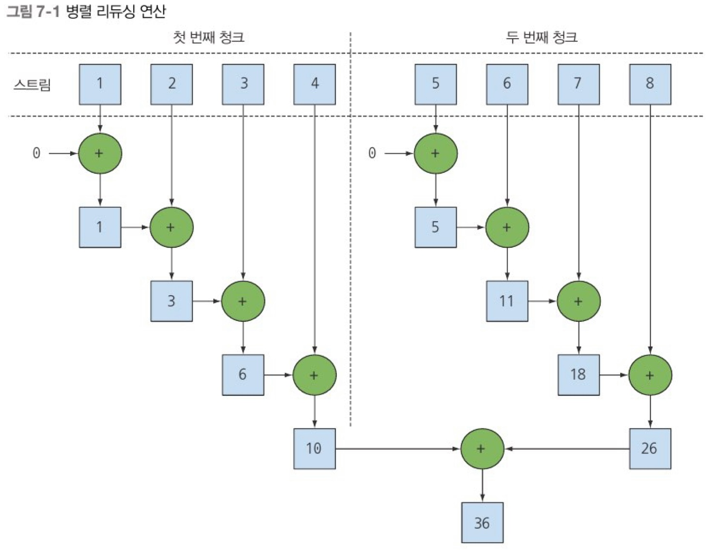
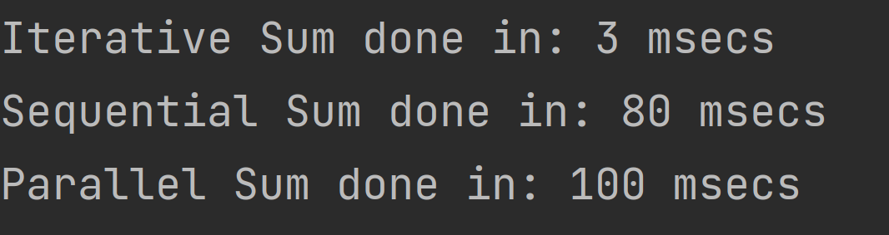
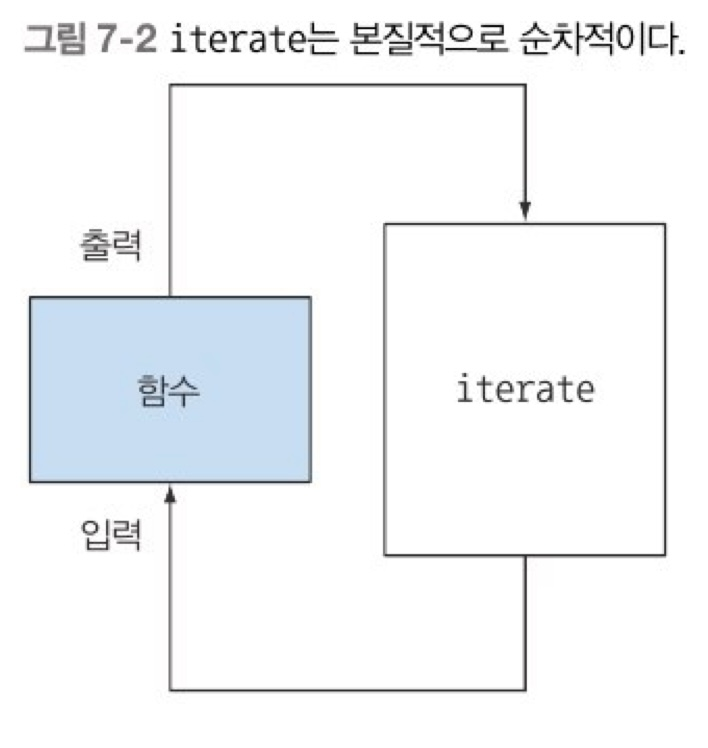
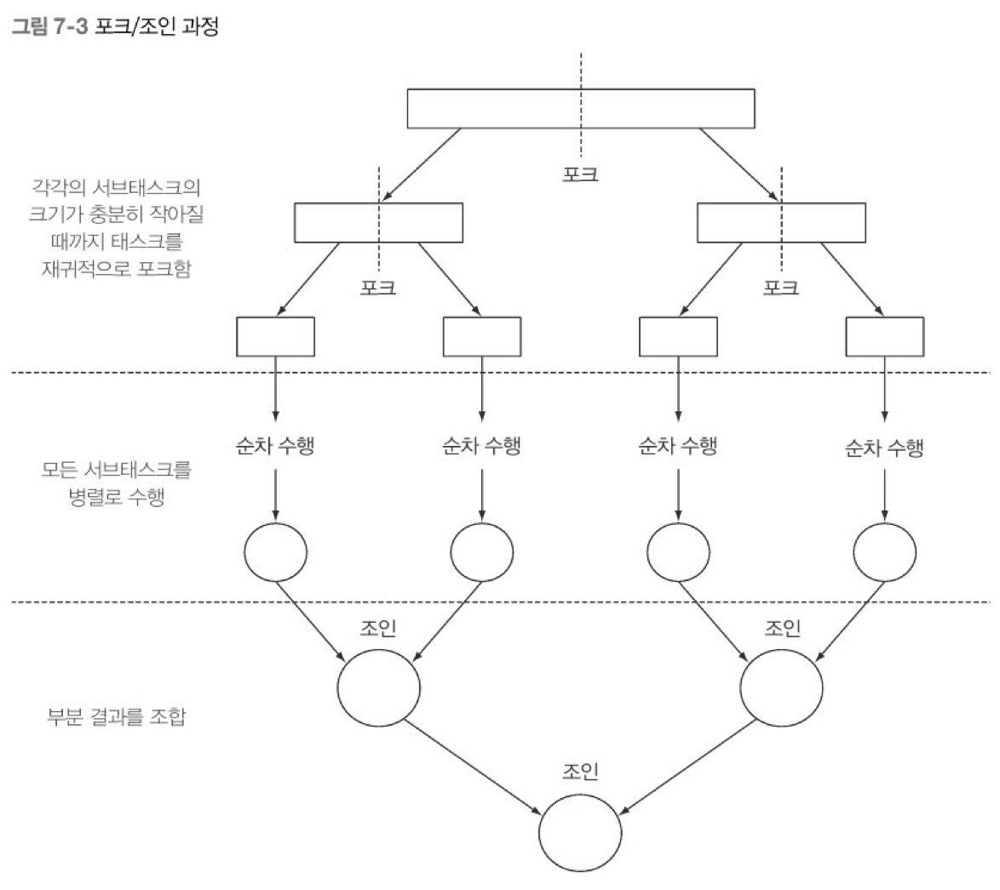
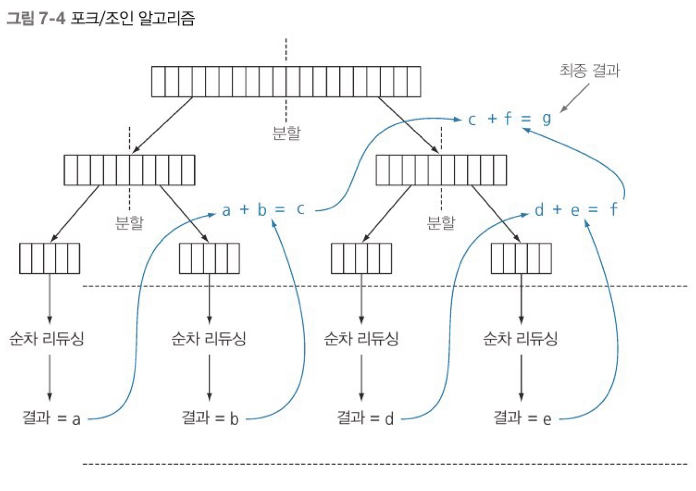
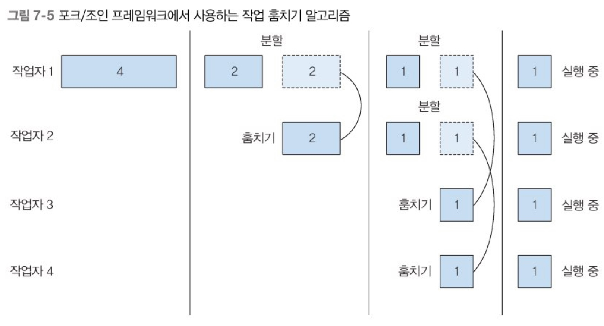
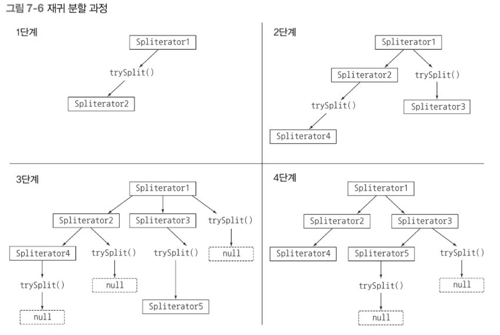
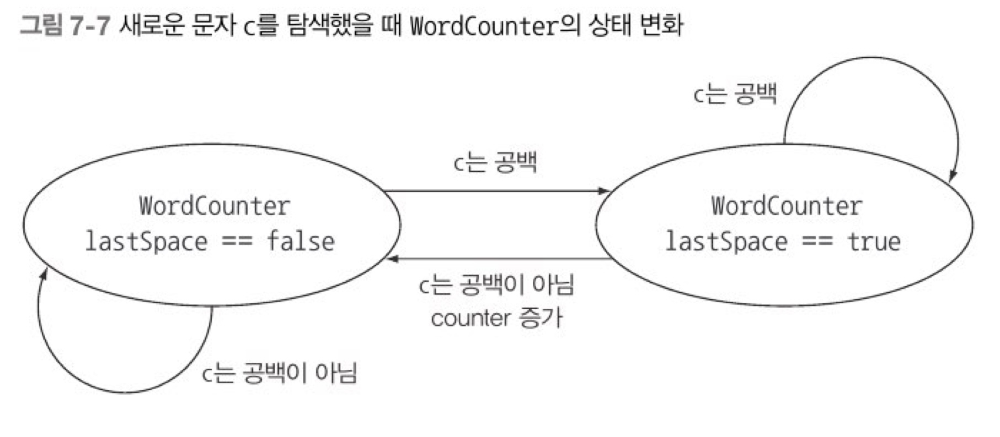

### 7.1 병렬 스트림

병렬 스트림(parallel stream)이란 각각의 스레드에서 처리할 수 있도록 스트림 요소를 여러 청크로 분할한 스트림. 병렬 스트림을 이용하면 모든 멀티코어 프로세서가 각각의 청크를 처리하도록 할당할 수 있다. 

```java
public long sequentialSum(long n){
        return Stream.iterate(1L, i->i+1)//무한 자연수 스트림 생성
                                    .limit(n)//n개 이하로 제한
                                    .reduce(0L,Long::sum);//모든 숫자를 더하는 스트림 리듀싱 연산 
}
```

```java
public long iterativeSum(long n){
        long result = 0;
        for(long i=1L;i<=n;i++){
                result+=i;
        }
        return result;
}
```

n이 커진다면 병렬로 처리하는 것이 좋음

**7.1.1 순차 스트림을 병렬 스트림으로 변환하기** 

```java
public long parallelStream(long n){
        return Stream.interate(1L, i->i+1)//무한 자연수 스트림 생성 
                                    .limit(n)//n개 이하로 제한
                                    .parallel()//스트림을 병렬 스트림으로 변환 
                                    .reduce(0L,Long::sum);//모든 숫자를 더하는 스트림 리듀싱 연산 
}
```




리듀싱 연산을 여러 청크에 병렬로 수행 후 마지막에 리듀싱 연산으로 생성된 부분 결과를 다시 리듀싱 연산으로 합쳐서 전체 스트림의 리듀싱 결과를 도출한다. 

```java
stream.parallel()
            .filter(...)
            .sequential()
            .map(...)
            .parallel()
            .reduce();
    //최종적으로 호출된 메서드가 전체 파이프라인에 영향을 미침. 이 예제는 parallel() 병렬로 실행
```

순차 스트림에 parallel()을 호출해도 스트림 자체에는 아무 변화도 일어나지 않는다. 내부적으로는 연산이 병렬로 수행해야 함을 의미하는 불리언 플래그가 설정된다. 반대로 sequential()로 병렬 스트림을 순차로 바꿀수 있다.

**7.1.2 스트림 성능 측정** 

병렬화를 이용하면 순차나 반복 형식에 비해 성능이 더 좋아질 것이라 추측하지만 함부로 추측하면 안된다. 정확한 측정을 통해 확인해봐야한다.

자바 마이크로벤치마크 하니스(JMH) 라이브러리를 이용해 벤치마크 구현 

```jsx
@BenchmarkMode(Mode.AverageTime)//벤치마크 대상 메서드를 실행하는 데 걸린 평균 시간 측정
@OutputTimeUnit(TimeUnit.MILLISECONDS)//벤치마크 결과를 밀리초 단위로 출력
@Fork(value = 2, jvmArgs = { "-Xms4G", "-Xmx4G" })//4Gb의 힙 공간을 제공한 환경에서 두번 벤치마크를 수행해 결과의 신뢰성 확보 
public class ParallelStreamBenchmark {

  private static final long N = 10_000_000L;

    @Benchmark//벤치마크 대상 메서드 
    public static long iterativeSum(long n) {
    long result = 0;
    for (long i = 0; i <= n; i++) {
      result += i;
    }
    return result;
  }

  @Benchmark//벤치마크 대상 메서드 
  public long sequentialSum() {
    return Stream.iterate(1L, i -> i + 1).limit(N).reduce(0L, Long::sum);
  }

  @Benchmark//벤치마크 대상 메서드 
  public long parallelSum() {
    return Stream.iterate(1L, i -> i + 1).limit(N).parallel().reduce(0L, Long::sum);
  }


  @TearDown(Level.Invocation)//매번 벤치마크를 실행한 다음에는 가비지 컬렉터 동작 시도 
  public void tearDown() {
    System.gc();
  }

}
```

벤치마크가 가능한 가비지 컬렉터의 영향을 받지 않도록 힙의 크기를 충분하게 설정

벤치마크가 끝날 때마다 가비지 컬렉터가 실행되도록 강제

❗ 그래도 여전히 결과는 정확하지 않을 수 있음



> 전동적인 for 루프를 사용한 **Iterative Sum**이 더 저수준으로 동작할 뿐 아니라 기본값을 박싱/언박싱 할 필요가 없으므로 **sequentialSum** 보다 더 빠를것.

> 하지만 병렬 스트림을 사용한 **ParallelSum**은 멀티코어 CPU를 활용하지 못하고 **sequentialSum** 보다 3배 이상 느린 결과 수행.

여기서 알수있는 점 

<aside>
🤫 반복 결과로 박싱된 객체가 만들어지므로 숫자를 더하려면 언박싱을 해야 한다.
반복 작업은 병렬로 수행할 수 있는 독립 단위로 나누기가 어렵다.

</aside>



이전 연산의 결과에 따라 다음 함수의 입력이 달라지기 때문에 iterate 연산을 청크로 분할하기 어려움

리듀싱을 시작하는 시점에 전체 숫자 리스트가 준비 되지 않았으므로 스트림을 병렬로 처리할 수 있도록 청크로 분할할 수 없다. 오히려 스레드를 할당하는 오버헤드만 증가하게 된다.

이처럼 병렬 프로그래밍은 까다롭고 이해하기 어려운 함정이 숨어있다. 심지어 오용하면 오히려 성능이 더 나빠질 수도 있다. **따라서 parallel 매서드를 호출했을 때 내부적으로 어떤일이 일어나는지 꼭 이해해야한다.** 

**더 특화된 메서드 사용**

LongStream.rangeClosed() 메서드

- 기본형 long을 직접 사용하므로 박싱과 언박싱 오버헤드가 사라진다.
- 쉽게 청크로 분할할 수 있는 숫자 범위를 생산한다. ex) 1-20 → 1-5, 6-10, 11-15, 16-20

```jsx
public static long rangedSum(long n) {
    return LongStream.rangeClosed(1, n)
                                            .reduce(Long::sum);
  }
```


벤치마크 결과

> Seqeuntial Sum에 비해 Range Sum이 빠름

<aside>
🤫 특화되지 않은 스트림을 처리할 때는 오토박싱, 언박싱 등의 오버헤드를 수반하기 때문 상황에 따라서는 어떤 알고리즘을 병렬화하는 것 보다 적절한 자료구조를 선택하는 것이 더 중요

</aside>

여기에 병렬 스트림을 적용

```jsx
public static long parallelRangedSum(long n) {
    return LongStream.rangeClosed(1, n)
                                            .parallel()
                                            .reduce(Long::sum);
  }
```


> 드디어 순차 실행(Seqeuntial Sum)보다 빠른 성능을 갖는 병렬 리듀싱(Parallel Ranged Sum)을 만들었다. 실질적으로 리듀싱 연산이 병렬로 수행되는 코드

<aside>
🤫 올바른 자료구조를 선택해야 병렬 실행도 최적의 성능을 발휘할 수 있다는 사실을 확인할 수 있다. 
함수형 프로그래밍을 올바로 사용하면 반복적으로 코드를 실행하는 방법에 비해 최신 멀티 코어 CPU가 제공하는 병렬 실행의 힘을 단순하게 직접적으로 얻을 수 있다.

하지만 **병렬화가 완전 공짜가 아니라는 사실**을 기억하자. 멀티코어 간의 데이터 이동은 생각보다 비싸다. 따라서 **코어 간에 데이터 전송 시간보다 훨씬 오래 걸리는 작업만 병렬로 다른 코어에서 수행하는 것이 바람직**하다.

</aside>

**7.1.3 병렬 스트림의 올바른 사용법** 

병렬 스트림을 잘못 사용하면서 발생하는 많은 문제는 공유된 상태를 바꾸는 알고리즘을 사용하기 때문에 일어난다. 

```java
public static long sideEffectSum(long n) {
    Accumulator accumulator = new Accumulator();//누적자 초기화
    LongStream.rangeClosed(1, n)
                            .forEach(accumulator::add);//리스트의 요소를 탐색하면서 누적자에 숫자 추가 
    return accumulator.total;
  }

  public static long sideEffectParallelSum(long n) {// sideEffectSum를 병렬로 실행
    Accumulator accumulator = new Accumulator();
    LongStream.rangeClosed(1, n)
                            .parallel()
                            .forEach(accumulator::add);
    return accumulator.total;
  }

  public static class Accumulator {
    private long total = 0;
    public void add(long value) {total += value;}
    }
```

본질적으로 순차 실행할 수 있도록 구현되어 있으므로 (sideEffectSum) 병렬 실행하면 (sideEffectParallelSum) 참사가 일어난다. 특히 total을 접근할때마다 데이터 레이스(다수의 스레드에서 동시에 데이터에 접근) 문제가 일어난다. 


sideEffectParallelSum 실행 결과

> 메서드의 성능은 둘째 치고 올바른 결과값이 나오질 않는다. 여러 스러드에서 동시에 누적자 total+=value 하면서 이런 문제가 발생한다.

**7.1.4 병렬 스트림 효과적으로 사용하기** 

n개 이상의 요소에 병렬 스트림 사용하라 처럼 양을 기준으로 병렬 스트림 사용을 결정하는 것은 적절치 않다. 

다만 참고할 수 있는 약간의 힌트는 다음과 같다. 

- 순차 스트림을 병렬 스트림으로 바꾸어 벤치마크로 직접 측정해보기
- 자동 박싱/언박싱 주의 성능을 크게 저하시키는 요소, 자바8에서 제공하는 기본 스트림(IntStream, LongStream, DoubleStream) 사용 추천
- 순사보다 병렬에서 성능이 떨어지는 연산: limit, findFirst 처럼 순서에 의존하는 연산
- 전체 파이프라인 연산 비용 고려하기 스트림 파이프라인 처리 비용= 처리해야 할 요소 수(N)*하나의 요소를 처리하는 비용(Q) , Q가 높다는것은 병렬 스트림으로 성능을 개선할 수 있는 가능성이 있음을 의미
- 소량의 데이터에서는 병렬 스트림이 도움이 되지 않음
- 스트림을 구성하는 자료구조가 적절한지 확인 (ex. ArrayList는 분할 시 모든 요소를 탐색 할 필요가 없어 모든 요소를 탐색해야하는 LinkedList보다 효율적으로 분할 할 수 있음)
- 스트림 특성과 파이프라인 주간 연산이 스트림 특성을 어떻게 바꾸는지 확인 (ex. SIZED 스트림은 정확히 같은 크기의 두 스트림으로 분할할 수 있으므로 효과적, 반면 필터 연산이 있을 경우 길이 예측이 불가함)
- 최종 연산 병합 과정 (Collector의 combiner 메서드) 비용을 살펴보기. 병합 과정의 비용이 비쌀경우 병렬 스트림으로 얻은 성능의 이익이 상쇄 될 수 있음.


### 7.2 포크/조인 프레임워크

포크/조인 프레임워크는 병렬화할 수 있는 작업을 재귀적으로 작은 작업으로 분할한 다음에 서브태스크 각각의 결과를 합쳐서 전체 결과를 만들도록 설계되었다.

**7.2.1 RecursiveTask 활용** 

스레드 풀을 이용하려면 RecursiveTask<R>의 서브클래스를 만들어야 한다 . R은 병렬화 된 태스크가 생성하는 결과 형식 또는 결과가 없을때 RecursiveAction 형식 

```java
compute(){
    if(태스크가 충분히 작거나 더 이상 분할할 수 없으면)
            순차적으로 태스크 계산
    else
            태스크를 두 서브태스크로 분할
            태스크가 다시 서브태스크로 분할되도록 이 메서드 재귀 호출
            모든 서브태스크 연산 완료될 때까지 기다림
            각 서브태스크의 결과를 합침
}
```



```java
public class ForkJoinSumCalculator extends RecursiveTask<Long> {
//RecursiveTask를 상속받아 포크/조인 프레임워크에서 사용할 태스크를 생성 

  private final long[] numbers;//더할 숫자 배열
  private final int start;
  private final int end;
  public static final long THRESHOLD = 10_000;//이 값 이하의 서브태스크는 더이상 분할 불가

  public ForkJoinSumCalculator(long[] numbers) {
    //메인 태스크를 생성할 때 사용할 공개 생성자 
    this(numbers, 0, numbers.length);
  }

  private ForkJoinSumCalculator(long[] numbers, int start, int end) {
    //메인 태스크의 서브 태스크를 재귀적으로 만들 때 사용할 비공개 생성자 
    this.numbers = numbers;
    this.start = start;
    this.end = end;
  }

  @Override
  protected Long compute() { //추상메서드 
    int length = end - start; // 더할 배열의 길이 
    if (length <= THRESHOLD) {
      return computeSequentially();//기준값과 같거나 작으면 순차적으로 결과 계산
    }
    ForkJoinSumCalculator leftTask = 
                    new ForkJoinSumCalculator(numbers, start, start + length / 2);
    //첫번째 절반을 더하는 서브태스크 
        leftTask.fork();
        //ForkJoinPool의 다른 스레드로 새로 생성한 태스크를 바로 비동기로 실행 
    ForkJoinSumCalculator rightTask = 
                    new ForkJoinSumCalculator(numbers, start + length / 2, end);
        //두번째 절반을 더하는 서브태스크    
        Long rightResult = rightTask.compute();
        //두번째 서브태스크를 동기 실행. 여기서 추가 분할이 일어날 수 잇음
    Long leftResult = leftTask.join();
        //첫번째 서브태스크 결과를 읽거나 결과가 없으면 기다림
    return leftResult + rightResult;
        //두 서브 태스크의 결과를 조합
  }

  private long computeSequentially() {
        //더 분할할 수 없는 태스크일때 결과를 계산하는 함수  
    long sum = 0;
    for (int i = start; i < end; i++) {
      sum += numbers[i];
    }
    return sum;
  }

  public static long forkJoinSum(long n) {
        //n까지의 자연수 덧셈 작업을 병렬로 수행하는 함수 
    long[] numbers = LongStream.rangeClosed(1, n).toArray();
    ForkJoinTask<Long> task = new ForkJoinSumCalculator(numbers);
    return FORK_JOIN_POOL.invoke(task);
  }

}
```

일반적으로 ForkJoinPool은 싱글턴으로 저장. 둘 이상 사용하지 않음. 

ForkJoinPool을 만들면서 인수가 없는 디폴트 생성자를 이용했는데 이는 JVM에서 이용할 수 있는 모든 프로세서가 자유롭게 풀에 접근할 수 있음을 의미한다. (실제 프로세서 외에 하이퍼스레딩과 관련된 가상 프로세서도 포함)



주어진 조건이 만족 될때까지 태스트 분할을 반복, 서브태스크는 순차적으로 처리되며 포킹 프로세스로 만들어진 이진트리의 태스크를 루트에서 역순으로 방문


> Parallel Range Sum 보다 Fork Join Sum이 성능이 나빠짐 이는 전체 스트림을 long[]으로 변환했기 때문.

**7.2.2 포크/조인 프레임워크를 제대로 사용하는 방법**

- join 메서드는 태스크 결과가 준비될 때까지 호출자를 블록 시킴. 따라서 두 호출자가 모두 시작된 다음에 join을 호출해야 함.
- RecursiveTask 내에서 invoke 메서드 호출 금지. 대신 compute나 fork 메서드 직접 호출. 순차코드에서 병렬 계산을 시작할 때만 invoke 사용
- 서브태스크에서 fork 메서드 호출해서 ForkJoinPool 일정을 조절할 수 있다. 왼쪽/오른쪽 모두 fork메서드 호출이 아니라 한쪽은 compute를 호출하는 것이 효율적. 하나는 같은 스레드를 재활용함으로 오버헤드를 피할 수 있음
- 포트/조인은 디버깅이 어렵다. 다른 스레드에서 compute를 호출하므로 스택 트레이스가 도움이 되지 않는다.
- 포트/조인이 순차처리보다 항상 빠르지는 않음. 각 서브 태스크의 실행 시간은 새로운 태스크를 포킹하는데 드는 시간보다 길어야 한다. (ex. I/O를 한 서브태스크에 할당, 다른 서브태스크에서는 계산을 실행) 또한 컴파일러 최적화는 병렬 버전보다 순차 버전에 집중될 수 있다 것도 고려해야함(ex. 순차 버전에서 죽은 코드를 분석해서 사용되지 않는 계은 아예 삭제)

**7.2.3 작업 훔치기** 

이론적으로 코어 개수만큼 병렬화된 태스크로 작업부하를 분할하면 모든 CPU코어에서 태스크를 실행하고 크기가 같은 태스크는 같은 시간에 종료될 것이라 생각하지만 현실에서는 분할기법이 효율적이지 않았거나, 디스크 접근 속도 저하, 외부 서비스 협력과정에서의 지연 등의 이유로 같은 시간에 종료되지 않는다. 

포크/조인 프레임워크에서는 이를 작업훔치기 기법으로 해결.

작업훔치기 기법에서는 모든 스레드를 거의 공정하게 분할. 각각의 스레드는 자신에게 할당된 태스크를 포함하는 이중 연결리스트를 참조하면서 작업이 끝날때 큐의 헤드에서 다른 태스크를 가져와서 작업을 처리한다. **다른 스레드가 바쁘게 일하고 있을때 먼저 일이 끝난 스레드는 다른 스레드의 큐의 꼬리에서 일을 가져와서 처리**한다. 따라서 태스크의 크기를 작게 나누어야 작업자 스레드 간의 **작업부하를 비슷한 수준으로 유지**할 수 있다. 



### 7.3 Spliterator 인터페이스

Spliterator은 분할할 수 있는 반복자 라는 의미로 요소 탐색 기능을 제공하며 병렬 작업에 특화되어 있다. 

```java
public interface Spliterator<T> {
        boolean tryAdvance(Consumer<? super T> action);
        //요소를 하나씩 순차적으로 소비하면서 탐색해야 할 요소가 남아있으면 참 반환 Iterator 역할
        Spliterator<T> trySplit();
        //Spliterator의 일부요소를 분할해서 두번째 Spliterator를 생성
        long estimateSize();
        //탐색해야 할 요소 수 정보를 제공
        int characteristics();
}
```

**7.3.1 분할 과정** 



1단계에서 첫 번째 Spliterator에 trySplit을 호출하면 두번째 Spliterator 생성

2단계에서 두개의 Spliterator에 trySplit을 호출하면 네개의 Spliterator 생성 

이처럼 trySplit의 결과가 null이 될때까지 이 과정을 반복, trySplit이 null이라는것은 더 이상 자료구조를 분할할 수 없음을 의미. 

4단계에서 Spliterator에 호출한 모든 trySplit의 결과가 null이면 재귀 분할 과정이 종료된다. 

Spliterator 특성 

characteristics 추상 메서드 정의, Spliterator 자체의 특성 집합을 포함하는 int를 반환. 


**7.3.2 커스텀 Spliterator 구현하기** 

```java
public static final String SENTENCE =
      " Nel   mezzo del cammin  di nostra  vita "
      + "mi  ritrovai in una  selva oscura"
      + " che la  dritta via era   smarrita ";

public static int countWordsIteratively(String s) {
    int counter = 0;
    boolean lastSpace = true;
    for (char c : s.toCharArray()) {//문자열의 모든 문자를 하나씩 탐색
      if (Character.isWhitespace(c)) {
        lastSpace = true;
      }
      else {
        if (lastSpace) counter++;
        lastSpace = Character.isWhitespace(c);
                //문자를 하나씩 탐색하다 공백 문자를 만나면 지금까지 탐색한 문자를 단어로 간주하여 단어수를 증가
      }
    }
    return counter;
  }
```


함수형으로 단어 수를 세는 메서드 재구현

```java
Stream<Character> stream = IntStream.range(0, s.length()).mapToObj(SENTENCE::charAt);
//String을 스트림으로 변환 

class WordCounter {
    private final int counter;
    private final boolean lastSpace;
    public WordCounter(int counter, boolean lastSpace) {
      this.counter = counter;
      this.lastSpace = lastSpace;
    }
    public WordCounter accumulate(Character c) {//반복 알고리즘처럼 accumulate 메서드는 문자열의 문자를 하나씩 탐색
      if (Character.isWhitespace(c)) {
        return lastSpace ? this : 
                new WordCounter(counter, true);
      }
      else {
        return lastSpace ? new WordCounter(counter + 1, false) : //문자를 하나씩 탐색하다 공백 문자를 만나면 지금까지 탐색한 문자를 단어로 간주하여 단어 수를 증가시킨다. 
                this;
      }
    }

    public WordCounter combine(WordCounter wordCounter) {
      return new WordCounter(counter + wordCounter.counter, //두 WordCounter의 counter 값을 더한다.
                                                            wordCounter.lastSpace);//counter값만 더할 것이므로 마지막 공백은 신경 쓰지 않는다. 
    }

    public int getCounter() {
      return counter;
    }

  }
```

스트림에 리듀싱 연산을 진행하면서 단어수를 계산. 



```java
private static int countWords(Stream<Character> stream) {
    WordCounter wordCounter = stream.reduce(new WordCounter(0, true), 
                                                                                                WordCounter::accumulate, 
                                                                                                WordCounter::combine);
    return wordCounter.getCounter();
  }

Stream<Character> stream = IntStream.range(0, s.length()).mapToObj(SENTENCE::charAt);
System.out.println("Found " + countWords(stream ) + " words");
```


병렬 스트림으로 처리

```java
System.out.println("Found " + countWords(stream.parallel()) + " words");
```


원래의 문자열을 임의의 위치에서 둘로 나누다보니 하나의 단어를 둘로 계산하는 상황이 발생. 순차 스트림을 병렬 스트림으로 바꿀 때 스트림 분할 위치에 따라 잘못된 결과가 나올 수 있다. 

→ 문자열을 임의의 우치에서 분할하지 말고 단어가 끝나는 위치에서 분할하는 방법으로 해결 

```java
private static class WordCounterSpliterator implements Spliterator<Character> {
    private final String string;
    private int currentChar = 0;
    private WordCounterSpliterator(String string) {
      this.string = string;
    }
    @Override
    public boolean tryAdvance(Consumer<? super Character> action) {
      action.accept(string.charAt(currentChar++));//현재 문자를 소비
      return currentChar < string.length();//소비할 문자가 남아있으면 true반환
    }
    @Override
    public Spliterator<Character> trySplit() {
      int currentSize = string.length() - currentChar;
      if (currentSize < 10) {
        return null;//파싱할 문자열을 순차 처리할 수 있을 만큼 충분히 작아졌음을 알리는 null반환
      }
      for (int splitPos = currentSize / 2 + currentChar; 
                            splitPos < string.length(); splitPos++) {//파싱할 문자열의 중간을 분할 위치로 설정
        if (Character.isWhitespace(string.charAt(splitPos))) {//다음 공백이 나올 때까지 분할 위치를 뒤로 이동
          Spliterator<Character> spliterator = // 처음부터 분할 위치까지 문자열을 파싱할 새로운 WordCounterSpliterator 생성
                        new WordCounterSpliterator(string.substring(currentChar, splitPos));
              currentChar = splitPos;//이 WordCounterSpliterator의 시작 위치를 분할 위치로 설정
              return spliterator;// 공백을 찾았고 문자열을 분리했으므로 종료 
        }
      }
      return null;
    }

    @Override
    public long estimateSize() {
      return string.length() - currentChar;
    }

    @Override
    public int characteristics() {
      return ORDERED + SIZED + SUBSIZED + NONNULL + IMMUTABLE;
    }

  }
```

- tryAdvnace: 문자열에서 현재 인덱스에 해당하는 문자를 Consumer에 제공한 다음에 인덱스를 증가. 인수로 전달된 Consumer는 스트림을 탐색하면서 적용해야 하는 함수 집합이 작업을 처리할 수 있도록 소비한 문자를 전달하는 자바 내부 클래스. 새로운 커서 위치가 전체 문자열 길이보다 작으면 참을 반환. 반복 탐색해야 할 문자가 남아 있음을 의미
- trySplit: 반복될 자료구조를 분할하는 로직. 예제에서는 한계값을 10개의 문자로 지정. 실전에서는 너무 많은 태스크를 만들지 않도록 더 높은 한계값을 설정. 분할과정에서 남은 문자 수가 한계값 이하면 null을 반환하여 분할을 중지. 반대로 분할이 필요한 상황에는 파싱해야 할 문자열 청크 중간 위치를 기준으로 분할. 단어 중간을 분할하지 않도록 빈 문자가 나올때까지 분할 위치를 이동시킴. 새로만든 Spliterator은 현재 위치 currentChar부터 분할된 위치까지 문자 탐색
- estimatedSize: 탐색해야 할 요소의 개수는 파싱할 문자열의 전체 길이와 현재 반복 중인 위치의 차
- characteristic:  ORDRED(문자열의 등장 순서가 유의미함), SIZED(estimatedSize 메서드 반환값이 정확함), SUBSIZED(trySplit으로 생성된 Spliterator도 정확한 크기를 가짐), NONNULL(문자열에는 null 문자가 존재하지 않음), IMMUTABLE(문자열 자체가 불변 크래스이므로 문자열을 파싱하면서 속성이 추가되지 않음)

WordCounterSpliterator 활용

```java
Spliterator<Character> spliterator = new WordCounterSpliterator(s);
Stream<Character> stream = StreamSupport.stream(spliterator, true);
```


### 7.4 마치며

- 내부 반복을 이용하면 명시적으로 다른 스레드를 사용하지 않고도 스트림을 병렬로 처리 할 수 있다.
- 간단하게 스트림을 병렬로 처리할 수 있지만 항상 병렬 처리가 빠른 것은 아니다. 병렬 소프트웨어 동작 방법과 성능은 직관적이지 않을 때가 많으므로 병렬 처리를 사용했을 때 성능을 직접 측정해봐야 한다.
- 병렬 스트림으로 데이터 집합을 병렬 실행할 때 특히 처리해야 할 데이터가 아주 많거나 각 요소를 처리하는 데 오랜 시간이 걸릴 때 성능을 높일 수 있다.
- 가능하면 기본형 특화 스트림을 사용하는 등 올바른 자료구조 선택이 어떤 연산을 병렬로 처리하는 것보다 성능적으로 더 큰 영향을 미칠 수 있다.
- 포크/조인 프레임워크에서는 병렬화할 수 잇는 태스크를 작은 태스크로 분할한 다음에 분할된 태스크를 각각의 스레드로 실행하며 서브태스크 각각의 결과를 합쳐서 최종결과를 생산한다.
- Spliterator는 탐색하려는 데이터를 포함하는 스트림을 어떻게 병렬화할 것인지 정의한다.