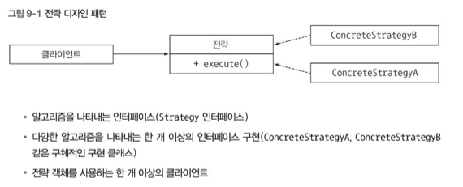
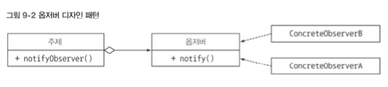
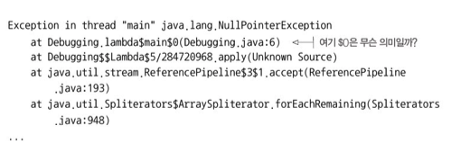
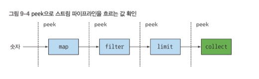
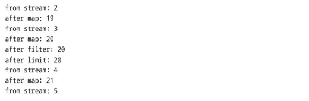

# Chapter 9 - 리팩터링, 테스팅, 디버깅

### 9.1 가독성과 유연성을 개선하는 리팩터링

**9.1.1 코드 가독성 개선**

코드 가독성이 좋다는 것은 일반적으로 어떤 코드를 다른 사람도 쉽게 이해할 수 있음 을 의미한다. 코드 가독성을 높이려면 코드의 문서화를 잘하고, 표준 코딩 규칙을 준수하는 등의 노력을 기울여야 한다. 

**9.1.2 익명 클래스를 람다 표현식으로 리팩터링하기** 

익명클래스는 코드를 장황하게 만들고 쉽게 에러를 일으킨다. 람다 표현식을 이용해서 간결하고, 가독성이 좋은 코드를 구현할 수 있다. 

```jsx
Runnable r1= new Runnable(){
        public void run(){
                System.out.println("Hello");
        }
};//익명클래스를 사용한 이전 코드

Runnable r2=()->System.out.println("Hello");//람다 표현식을 사용한 최신 코드 
```

하지만 모든 익명 클래스를 람다 표현식으로 변환할 수 있는 것은 아니다. 

첫째, 익명 클래스에서 사용한 this와 super는 람다 표현식에서 다른 의미를 갖는다. 익명클래스의 this는 익명클래스 자신을 가리키지만 람다에서 this는 람다를 감싸는 클래스를 가리킨다. 

둘째, 익명 클래스는 감싸고 있는 클래스의 변수를 가릴 수 있다(섀도 변수) 하지만 다음 코드처럼 람다 표현식으로는 변수를 가릴 수 없다. 

```jsx
int a =10;

Runnable r1=()->{
        int a=2;//컴파일 에러
        System.out.println(a);
};

Runnable r1= new Runnable(){
        public void run(){
                int a=2;
                System.out.println(a);//잘 작동한다. 
        }
};
```

마지막으로, 익명클래스를 람다 표현식으로 바꾸면 콘텍스트 오버로딩에 따른 모호함이 초래 될 수 있다. 익명 클래스는 인스턴스화 할때 명시적으로 형식이 정해지는 반면 람다형식은 콘텍스트에 따라 달라지기 때문이다.

```jsx
interface Task{
        public void execute();
}
public static void doSomething(Runnable r){r.run();}
public static void doSomething(Task a){a.execute();}

doSomething(new Task(){
        public void execute(){
                System.out.println("Danger danger!!");
        }
});

doSomething(()-> System.out.println("Danger danger!!"));
//doSomething(Runnable) doSomething(Task) 중 어느 것을 가리키는지 알 수 없는 모호함 발생 

doSomething((Task)()-> System.out.println("Danger danger!!"));
//명시적 형변환을 사용하여 모호함 제거 
```

**9.1.3 람다 표현을 메서드 참조로 리팩터링하기**

람다 표현식 대신 메서드 참조의 메서드 명으로 코드의 의도를 명확하게 알림으로써 가독성을 높일 수 있다. 

```jsx
Map<CaloricLevel, List<Dish>> disesByByCaloricLevel =
     menu.stream().collect(
        groupingBy(dish -> {
                    if (dish.getCalories() <= 400) {return CaloricLevel.DIET;}
                    else if (dish.getCalories() <= 700) {return CaloricLevel.NORMAL;}
                    else {return CaloricLevel.FAT;}
        })
    );

Map<CaloricLevel, List<Dish>> disesByByCaloricLevel=
        menu.stream().collect(groupingBy(Dish.getCaloricLevel));
//람다 표현식을 메서드로 추출 

public class Dish{
        ...
        public CaloricLevel getCaloricLevel(){
                if (dish.getCalories() <= 400) {return CaloricLevel.DIET;}
                else if (dish.getCalories() <= 700) {return CaloricLevel.NORMAL;}
                else {return CaloricLevel.FAT;}
        }
}
```

또한 comparing, maxBy 같은 정적 헬퍼 메서드를 활용하는 것도 좋다. 이들은 람다 표현식 보다는 메서드 참조가 코드의 의도를 더 명확하게 보여준다. 

**9.1.4 명령형 데이터 처리를 스트림으로 리팩터링하기**

이론적으로 반복자를 이용한 기존의 모든 컬렉션 처리 코드를 스트림 API로 변경해야한다. 스트림 API는 쇼트서킷과 게으름이라는 강력한 최적화뿐 아니라 멀티코어 아키텍처를 활용할 수 있는 지름길을 제공한다. 

```jsx
for(Dish dish:menu){
    if(dish.getCalories()>300){
        dishNames.add(dish.getName());
    }
}

menu.parallelStream()
        .filter(d->d.getCalories>300)
        .map(Dish::getName)
        .collect(toList());
```

**9.1.5 코드 유연성 개선**

함수형 인터페이스 적용

**조건부 연기 실행(conditional deferred execution)**

실제 작업을 처리하는 코드 내부 제어 흐름문이 복잡하게 얽힌 코드를 볼 수 있다. 보안검사나 로깅 관련 코드가 이처럼 사용된다. 

```java
if(logger.isLoggable(log.FINER)){
        logger.finer("Problem: "+generateDiagnostic());
}
```

- logger의 상태가 isLoggable이라는 메서드에 의해 클라이언트 코드로 노출된다.
- 메시지를 로깅할 때마다 logger 객체의 상태를 매번 확인해야 할까? 이는 코드를 어지럽힐 뿐이다.

```java
logger.log(Level.FINER, "Problem: "+generateDiagnostic());
```

- 불필요한 if문 제거, logger상태 노출할 필요가 없으므로 위 코드가 더 바람직한 구현
- 하지만, logger가 활성화 되어 있지 않더라도 항상 로깅 메세지를 평가하게 되는 문제 발생

```java
public void log(Level level, Supplier<String> msgSupplier)
//자바8에서 제공하는 메서드

logger.log(Level.FINER, ()->"Problem: "+generateDiagnostic());
```

- 코드 가독성, 캡슐화 강화

**실행 어라운드(execute around)**

매번 같은 준비, 종료 과정을 반복적으로 수행한다면 이를 람다로 변환할 수 있다. 

```java
String oneLine = processFile((BufferedReader br)->br.readLine());//람다 전달
String twoLines = processFile((BufferedReader br)->br.readLine()+br.readLine());//다른 람다 전달

public String processFile(BufferedReaderProcessor p) throws IOException{
    try(BufferedReader br = new BufferedReader(new FileReader("data.txt"))){
            return p.process(br);//인수로 전달된 BufferedReaderProcessor 실행 
    }
}
```

### 9.2 람다로 객체지향 디자인 패턴 리팩터링하기

9.2.1 전략 

전략 패턴은 한 유형의 알고리즘을 보유한 상태에서 런타임에 적절한 알고리즘을 선택하는 기법이다. 



예를 들어 오직 소문자 또는 숫자로 이루어져야 하는 등 텍스트 입력이 다양한 조건에 맞게 포맷되어 있는지 검증한다고 가정하자 

```java
public interface ValidationStrategy {
    boolean execute(String s);
}//String 문자열을 검증하는 인터페이스 

public class IsAllLowerCase implements ValidationStrategy {
    @Override
    public boolean execute(String s) {
      return s.matches("[a-z]+");
    }
}
public class IsNumeric implements ValidationStrategy {
    @Override
   public boolean execute(String s) {
      return s.matches("\\d+");
   }
}

static private class Validator {
        private final ValidationStrategy strategy;
        public Validator(ValidationStrategy v) {
      strategy = v;
    }
        public boolean validate(String s) {
      return strategy.execute(s);
    }
}

Validator v1 = new Validator(new IsNumeric());
System.out.println(v1.validate("aaaa"));
Validator v2 = new Validator(new IsAllLowerCase());
System.out.println(v2.validate("bbbb"));
//기존 자바 코드

Validator v3 = new Validator((String s) -> s.matches("\\d+"));
System.out.println(v3.validate("aaaa"));
Validator v4 = new Validator((String s) -> s.matches("[a-z]+"));
System.out.println(v4.validate("bbbb"))
//람다식 사용 코드 
```

9.2.2 템플릿 메서드 

알고리즘을 사용하고 싶은데 그대로는 안되고 조금 고쳐야 하는 상황

```java
abstract class OnlineBanking {
  public void processCustomer(int id) {
    Customer c = Database.getCustomerWithId(id);
    makeCustomerHappy(c);
  }
  abstract void makeCustomerHappy(Customer c);
}
```

```java
public void processCustomer(int id, Consumer<Customer> makeCustomerHappy) {
    Customer c = Database.getCustomerWithId(id);
    makeCustomerHappy.accept(c);
}
new OnlineBankingLambda().processCustomer(1337, (Customer c) -> System.out.println("Hello!"));
```

9.2.3 옵저버 

어떤 이벤트가 발생했을 때 한 객체(주체)가 다른 객체 리스트(옵저버)에 자동으로 알림을 보내야하는 상황



```java
interface Observer {
    void notify(String tweet);
}//옵저버를 그룹화할 인터페이스

class NYTimes implements Observer {
   public void notify(String tweet) {
      if (tweet != null && tweet.contains("money")) {
        System.out.println("Breaking news in NY!" + tweet);
      }
   }
}

class Guardian implements Observer {
        public void notify(String tweet) {
      if (tweet != null && tweet.contains("queen")) {
        System.out.println("Yet another news in London... " + tweet);
      }
    }
}

class LeMonde implements Observer {
        public void notify(String tweet) {
      if (tweet != null && tweet.contains("wine")) {
        System.out.println("Today cheese, wine and news! " + tweet);
      }
}

interface Subject {
    void registerObserver(Observer o);
    void notifyObservers(String tweet);
}//주제를 구현할 subject 인터페이스 

class Feed implements Subject {
        private final List<Observer> observers = new ArrayList<>();
        public void registerObserver(Observer o) {
      observers.add(o);
    }
        public void notifyObservers(String tweet) {
      observers.forEach(o -> o.notify(tweet));
    }
}

Feed f = new Feed();
f.registerObserver(new NYTimes());
f.registerObserver(new Guardian());
f.registerObserver(new LeMonde());
f.notifyObservers("The queen said her favourite book is Java 8 & 9 in Action!");
```

Feed는 트윗을 받았을 때 알림을 보낼 옵저버 리스트를 유지 한다. 

람다 표현식 사용하기 

```java
f.registerObserver((String tweet) -> {
     if (tweet != null && tweet.contains("money")) {
       System.out.println("Breaking news in NY! " + tweet);
     }
});
f.registerObserver((String tweet) -> {
     if (tweet != null && tweet.contains("queen")) {
       System.out.println("Yet another news in London... " + tweet);
     }
});
```

여러 메서드를 정의하는 등 복잡한 클래스라면 람다 표현식보다 기존의 클래스 구현방식을 고수하는 것이 바람직할 수도 있다. 

9.2.4 의무체인

작업 처리 객체의 체인을 만들 때는 의무 체인 패턴을 사용한다. 

```java
public class ProductFactory {
    public static class createProduct(String name) {
      switch (name) {
        case "loan": return new Loan();
        case "stock": return new Stock();
        case "bond": return new Bond();
        default: throw new RuntimeException("No such product " + name);
      }
   }
}
Product p = ProductFactory.createProduct("loan");
```

Loan, Stock, Bond는 모두 Product의 서브형식, 위 코드의 장점은 생성자와 설정을 외부로 노출하지 않음으로써 클라이언트가 단순하게 상품을 생산할 수 있다는 것이다. 

람다 표현식 사용하기

```java
final static Map<String, Supplier<Product>> map = new HashMap<>();
static {
    map.put("loan", Loan::new);
    map.put("stock", Stock::new);
    map.put("bond", Bond::new);
}
public static Product createProduct(String name) {
    Supplier<Product> p = map.get(name);
    if (p != null) {return p.get();}
    throw new RuntimeException("No such product " + name);
}
```

9.2.5 ???

### 9.3 람다 테스팅

일반적으로 좋은 소프트웨어 공학자라면 프로그램이 의도대로 동작하는지 확인할 수 있는 단위테스팅을 진행한다. 

9.3.1 보이는 람다 표현식의 동작 테스팅 

- 필요하다면 람다를 필드에 저장해서 재사용할 수 있으며 로직을 테스트 할 수 있다.
- 메서드를 호출하는것처럼 람다를 사용할 수 있다.

9.3.2 람다를 사용하는 메서드의 동작에 집중하라

- 람다의 목표는 정해진 동작을 하나의 조각으로 캡슐화하는 것이다.
- 세부 구현을 포함하는 람다 표현식은 공개하지 말아야 한다.
- assert 대상 적절히 작성 (equals 등)

9.3.3 복잡한 람다를 개별 메서드로 분할하기

- 복잡한 람다 표현식 메서드 참조로 바꾼다.(새로운 일반 메서드 선언)

9.3.4 고차원 함수 테스팅

- 함수를 인수로 받거나 반환하는 메서드의 경우
- 다른 람다로 메서드의 동작을 테스트할 수 있음
- ex) 다양한 프레디케이트로 filter 검증

### 9.4 디버깅

9.4.1 스택 트레이스 확인 

람다와 스택 트레이스 



lambda$main$0 은 람다를 참조하는 이름 

메서드 참조를 사용해도 스택 트레이스에는 메서드 명이 나타나지 않음 

따라서 람다 표현식과 관련된 스택 트레이스는 이해하기 어려울 수 있다는 점을 염두해 두어야한다.

9.4.2 정보 로깅 



peek 이라는 스트림 연산을 활용하여 각 스트림 요소를 소비한것 처럼 동작을 실행할 수 있다.

peek은 자신이 확인한 요소를 파이프라인 다음 연산 그대로 전달 한다. 

```java
public static void main(String[] args) {
    List<Integer> result = Stream.of(2, 3, 4, 5)
        .peek(x -> System.out.println("taking from stream: " + x))
        .map(x -> x + 17)
        .peek(x -> System.out.println("after map: " + x))
        .filter(x -> x % 2 == 0)
        .peek(x -> System.out.println("after filter: " + x))
        .limit(3)
        .peek(x -> System.out.println("after limit: " + x))
        .collect(toList());
}
```

