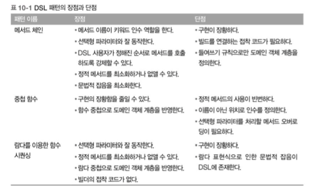

# Chatper 10 - 람다를 이용한 도메인 전용 언어


### 10.1 도메인 전용 언어(domain-specific languages)

DSL이란 특정 비즈니스 도메인을 인터페이스로 만든 API라고 생각할 수 있다.

DSL에서 동작과 용어는 특정 도메인에 국한되므로 다른 문제는 걱정할 필요가 없고 오직 자신의 앞에 놓인 문제를 어떻게 해결할지에만 집중할 수 있다. DSL을 이용하면 사용자가 특정 도메인의 복잡성을 더 잘 다룰 수 있다. 

- 의사 소통의 왕: 우리의 코드의 의도가 명확히 전달되어야하며 프로그래머가 아닌 사람도 이해할 수 있어야 한다. 이런 방식으로 코드가 비즈니스 요구사항에 부합하는지 확인 할 수 있다.
- 한번의 코드를 구현하지만 여러번 읽는다: 가독성은 유지보수의 핵심이다. 즉 항상 우리의 동료가 쉽게 이해할 수 있도록 코드를 구현해야 한다.

**10.1.1 DSL의 장단점**

장점 

- 간결함: API는 비즈니스 로직을 간편하게 캡슐화하므로 반복을 피할 수 있고 코드를 간결하게 만들 수 있다.
- 가독성: 도메인 영역의 용어를 사용하므로 비 도메인 전문가도 코드를 쉽게 이해할 수 있다. 결과적으로 다양한 조직 구성원 간에 코드와 도메인 영역이 공유될 수 있다.
- 유지보수: 잘 설계된 DSL로 구현한 코드는 쉽게 유지보수하고 바꿀 수 있다. 유지보수는 비즈니스 관련 코드 즉 가장 빈번히 바뀌는 애플리케이션 부분에 특히 중요하다.
- 높은 수준의 추상화: DSL은 도메인과 같은 추상화 수준에서 동작하므로 도메인의 문제와 직접적으로 관련되지 않은 세부 사항을 숨긴다.
- 집중: 비즈니스 도메인의 규칙을 표현할 목적으로 설계된 언어이므로 프로그래머가 특정 코드에 집중할 수 있다. 결과적으로 생산선이 좋아진다.
- 관심사분리: 지정된 언어로 비즈니스 로직을 표현함으로 애플리케이션의 인프라구조와 관련된 문제와 독립적으로 비즈니스 관련된 코드에서 집중하기가 용이하다. 결과적으로 유지보수가 쉬운 코드를 구현한다.

단점:

- DSL 설계의 어려움: 간결하게 제한적인 언어에 도메인 지식을 담는 것이 쉬운 작업은 아니다.
- 개발비용: 초기에 많은 비용과 시간이 소모, 유지보수 변경이 프로젝트에 부담을 주는 요소이다.
- 추가 우회 계층: 추가적인 계층으로 도메인 모델을 감싸며 이 계층을 최대한 작게 만들어 성능 문제를 회피한다.
- 새로 배워야  하는 언어: 팀에 배워야하는 언어가 한개 더 늘어난다는 부담이 있다. 여러 비즈니스 도메인을 다루는 상황이라면 이들을 유기적으로 동작하도록 합치는 일은 쉬운 ㅇ리이 아니다.
- 호스팅 언어 한계: 일부 자바 같은 범용 프로그래밍 언어는 장황하고 엄격한 문법을 가졌기에 사용자 친화적으로 DSL을 만들기가 힘들다.

**10.1.2 JVM에서 이용할 수 있는 다른 DSL 해결책**

DSL의 카테고리를 구분하는 가장 흔한 방법은 내부/외부 DSL을 나누는 것이다. 내부DSL(임베디드 DSL)은 순수 자바 코드 같은 기존 호스팅 언어를 기반으로 구현하는 반면, 스탠드어론이라 불리는 외부 DSL은 호스팅 언어와는 독립적으로 자체의 문법을 가진다. 더욱이 JVM으로 인해 내부/외부의 중간 카테고리에 해당하는 중간 DSL이 만들어질 가능성이 생겼다. 우리는 이들을 다중 DSL이라는 카테고리로 칭한다. 

**내부 DSL**

내부DSL이란 자바로 구현한 DSL을 의미한다. 기존의 자바는 다소 귀찮고, 유연성이 떨어지는 문법 때문에 읽기 쉽고, 간단하고, 표현력 있는 DSL을 만드는데 한계가 있었지만 람다 표현식이 등장하면서 이 문제가 어느정도 해결 되었다.

순수 자바 DSL을 구현함으로 얻는 장점

- 새로운 패턴과 기술을 배워 DSL을 구현하는 노력이 현저히 줄어든다.
- 나머지 코드와 함께 컴파일을 할 수 있다. 추가 비용이 들지 않는다.
- 개발팀이 새로운 언어를 배우거나 복잡한 외부 구조를 배울 필요가 없다.
- DSL사용자는 기존의 자바 IDE를 이용해 자동완성, 자동리팩터링 같은 기능을 그대로 즐길 수 있다.
- 추가로 DSL을 개발해야 하는 상황에서 자바를 이용한다면 추가 DSL을 쉽게 합칠 수 있다.

**다중DSL**

같은 자바 바이트코드를 사용한 JVM기반 프로그래밍 언어를 이용

개발자가 아닌 사람도 코드를 쉽게 이해할 수 있다는 것이 큰 강점 

하지만 다음과 같은 불편함도 있음

- 새로운 프로그래밍 언어를 배우거나 누군가는 기술을 가지고 있어야 한다.
- 두개 이상의 언어가 혼재하므로 여러 컴파일러로 소스를 빌드하도록 빌드 과정을 개선해야 한다.
- 자바와 호환성이 완벽하지 않을 때가 많다.

**외부DSL**

자신만의 문법과 구문으로 새 언어를 설계, 새언어를 파싱하고 파서의 결과를 분석하고, 외부 DSL을 실행할 코드를 만들어야한다. 

가장 큰 장점은 외부 DSL이 제공하는 무한한 유연성이다. 우리에게 필요한 특성을 완벽하게 제공하는 언어를 설계할 수 있다. 

자바로 개발된 인프라 구조 코드와 외부 DSL로 구현한 비즈니스 코드를 명확하게 분리한다는 것도 장점이다. 하지만 이 분리로 인해 DSL과 호스트 언어 사이에 인공 계층이 생기므로 이는 양날의 검이다. 

### 10.2 최신 자바 API의 작은 DSL

자바의 새로운 기능의 장점을 적용한 첫 API는 네이티브 자바 API 자신이다. 자바 8 이전의 네이티브 자바 API는 이미 한 개의 추상 메서드를 가진 인터페이스를 갖고 있었다. 하지만 무명 내부 클래스를 구현하려면 불필요한 코드가 추가되어야 한다. 람다와 메서드 참조가 등장하면서 게임의 규칙이 바뀌었다. 

```java
Colletions.sort(persons, new Comparator<Person>(){
    public int compare(Person p1, Person p2){
        return p1.getAge() - p2.getAge();
    }
});//내부 클래스로 Comparator 인터페이스를 구현

persons.sort(comparing(Person::getAge)
                        .thenComparing(Person::getName));
//자바8에서 추가된 기능들을 이용해 comparing을 구현하고 이름순으로 정렬 
```

**10.2.1 스트림 API는 컬렉션을 조작하는 DSL**

Stream 인터페이스는 네이티브 자바 API에 작은 내부 DSL을 적용한 좋은 예이다. 

```java
List<String> errors= Files.lines(Paths.get(fileName))//파일을 열어 문자열 스트림 생성
                                                    .filter(line->line.startsWith("ERROR"))//ERROR로 시작하는 행을 필터링
                                                    .limit(40)//결과를 40행으로 제한
                                                    .collect(toList());//결과 문자열을 리스트로 수집
```

스트림 API의 플루언트 형식은 잘 설계된 DSL의 또 다른 특징이다. 모든 중간 연산은 게으르며 다른 연산으로 파이프라인될 수 있는 스트림으로 반환된다. 최종 연산은 적극적이며 전체 파이프라인이 계산을 일으킨다. 

**10.2.2 데이터를 수집하는 DSL인 Collectors** 

DSL관점에서 콜렉터 메서드가 설계되었는지 확인한다. Collectors는 다중 수준 그룹화를 달성할 수 있도록 합쳐질 수 있다. 

```java
Map<String, Map<Color, List<Car>>> carsByBrandAndColor = 
        cars.stream().collect(groupingBy(Car::getBrand,groupingBy(Car::getColor)));
```

두 Comparator를 플루언트 방식으로 연결해서 다중 필드 Comparator를 정의

```java
Collector<? super Car, ?, Map<Brand, Map<Color, List<Car>>>> c =
        arGroupingCollector=
                groupingBy(Car::getBrand, groupingBy(Car::getColor));
```

Collectors API를 이용해 Collectors를 중첩함으로 다중 수준 Collector를 만들 수 있다. 

특히 셋 이상의 컴포넌트를 조합할 때는 보통 플루언트 형식이 중첩 형식에 비해 가독성이 좋다. 

🥲 ??

```java
public static class GroupingBuilder<T, D, K> {

    private final Collector<? super T, ?, Map<K, D>> collector;

    public GroupingBuilder(Collector<? super T, ?, Map<K, D>> collector) {
      this.collector = collector;
    }

    public Collector<? super T, ?, Map<K, D>> get() {
      return collector;
    }

    public <J> GroupingBuilder<T, Map<K, D>, J> after(Function<? super T, ? extends J> classifier) {
      return new GroupingBuilder<>(groupingBy(classifier, collector));
    }

    public static <T, D, K> GroupingBuilder<T, List<T>, K> groupOn(Function<? super T, ? extends K> classifier) {
      return new GroupingBuilder<>(groupingBy(classifier));
    }
}
```

### 10.3 자바로 DSL을 만드는 패턴과 기법

- 모델 클래스 코드
  
  ```java
  public class Stock {
  
    private String symbol;
    private String market;
  
    public String getSymbol() {
      return symbol;
    }
  
    public void setSymbol( String symbol ) {
      this.symbol = symbol;
    }
  
    public String getMarket() {
      return market;
    }
  
    public void setMarket( String market ) {
      this.market = market;
    }
  
    @Override
    public String toString() {
      return String.format("Stock[symbol=%s, market=%s]", symbol, market);
    }
  
  }
  ```
  
  ```java
  public class Trade {
  
    public enum Type {
      BUY,
      SELL
    }
  
    private Type type;
    private Stock stock;
    private int quantity;
    private double price;
  
    public Type getType() {
      return type;
    }
  
    public void setType(Type type) {
      this.type = type;
    }
  
    public int getQuantity() {
      return quantity;
    }
  
    public void setQuantity(int quantity) {
      this.quantity = quantity;
    }
  
    public double getPrice() {
      return price;
    }
  
    public void setPrice(double price) {
      this.price = price;
    }
  
    public Stock getStock() {
      return stock;
    }
  
    public void setStock(Stock stock) {
      this.stock = stock;
    }
  
    public double getValue() {
      return quantity * price;
    }
  
    @Override
    public String toString() {
      return String.format("Trade[type=%s, stock=%s, quantity=%d, price=%.2f]", type, stock, quantity, price);
    }
  
  }
  ```
  
  ```java
  public class Order {
  
    private String customer;
    private List<Trade> trades = new ArrayList<>();
  
    public void addTrade( Trade trade ) {
      trades.add( trade );
    }
  
    public String getCustomer() {
      return customer;
    }
  
    public void setCustomer( String customer ) {
      this.customer = customer;
    }
  
    public double getValue() {
      return trades.stream().mapToDouble( Trade::getValue ).sum();
    }
  
    @Override
    public String toString() {
      String strTrades = trades.stream().map(t -> "  " + t).collect(Collectors.joining("\n", "[\n", "\n]"));
      return String.format("Order[customer=%s, trades=%s]", customer, strTrades);
    }
  
  }
  ```

**10.3.1 메서드 체인**

여러 빌드 클래스 특히 두개의 거래 빌더를 따로 만듦으로써 사용자가 미리 지정된 절차에 따라 플루언트 API 메서드를 호출하도록 강제한다. 덕분에 사용자가 다음 거래를 설정하기 전에 기존 거래를 올바로 설정하게 된다. 이 접근 방법은 주문에 사용한 파라미터가 빌더 내부로 국한된다는 다른 이점도 제공한다. 이 방법은 정적 메서드 사용을 최소화 하고 DSL의 가독성을 개선하는 효과를 더한다. 

하지만 안타깝게도 빌더를 구현해야 한다는 것이 메서드 체인의 단점이다. 상위 수준의 빌더를 하위 수준의 빌더와 연결할 많은 모드가 필요하다. 도메인 객체 중첩 구조와 일치하게 들여쓰기를 강제하는 방법이 없다는 것도 단점이다.

**10.3.2 중첩된 함수 이용**

다른 함수안에 함수를 이용해 도메인 모델을 만든다. 

메서드 체인에 비해 중첩방식이 도메인 객체 계층 구조에 극대로 반영 된다는 것이 장점이다.

하지만 결과 DSL에 더 많은 괄호를 사용한다는 점과 인수 목록을 정적 메서드에 넘겨줘야한다는 제약도 있다. 도메인 객체에 선택사항 필드가 있으면 인수를 생략할 수 있으므로 여러 메서드 오버라이드도 구현해야한다. 마지막으로 인수의 의미가 이름이 아니라 위치에 의해 정의 되었다. 

**10.3.3 람다 표현식을 이용한 함수 시퀀싱**

람다표현식을 받아 실행해 도메인 모델을 만들어 내는 여러 빌더를 구현해야 한다. 이 패턴은 이전 두가지 방식의 장점을 더한다. 메서드 체인 패턴처럼 플루언트 방식으로 거래 주문을 정의 할 수 있다. 또한 중첩 함수 형식처럼 다양한 람다 표현식의 주첩 수준과 비슷하게 도메인 객체 계층 구조를 유지한다. 

하지만 안타깝게도 많은 설정 코드가 필요하며 DSL 자체가 자바 8 람다 표현식 문법에 의한 잡음의 영향을 받는다는 것이 이 패턴의 단점이다. 

**10.3.4 조합하기** 

지금까지 살펴본 세가지 DSL 패턴 각자가 장단점을 갖고 있다. 세가지 패턴을 혼용해 가독성 있는 새로운 DSL을 만들 수도 있다. 하지만 이 방법은 여러 가지 기법을 혼용하고 있으므로 한가지 방법을 적용한 DSL에 비해 사용자가 DSL을 배우는 시간이 오래 걸린다는 것이다. 

**10.3.5. DSL에 메서드 참조하기**

### 10.4 실생활의 자바 8 DSL



**10.4.1 jOOQ**

SQL은 DSL을 가장 흔히 광범위하게 사용하게 사용하는 분야이다. jOOQ는 SQL을 구현하는 내부적DSL로 자바에 직접 내장된 형식 안전 언어이다. 스트림 API와 조합하여 사용할 수 있다는 것이 장점이다. 

**10.4.2 큐컴버**

동작주도개발(BDD)은 테스트 주도 개발의 확장ㅇ으로 다양한 비즈니스 시나리오를 구조적으로 서술하는 간단한 도메인 적용 스트립팅 언어를 사용한다. 큐컴버는 다른 BDD 프레임워크와 마찬가지로 이들 명령문을 실행할 수 있는 테스트 케이스로 변환한다. 

**10.4.3 스프링 통합**

스프링 통합은 유명한 엔터프라이즈 통합 패턴을 지원할 수 있도록 의존성 주입에 기반한 스프링 프로그래밍 모델을 확장한다. 스프링 통합의 핵심 목표는 복잡한 엔터프라이즈 통합 솔루션을 구현하는 단순한 모델을 제공하고 비동기, 메시지 주도 아키텍쳐를 쉽게 적용할 수 있도록 돕는 것이다.