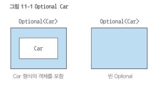
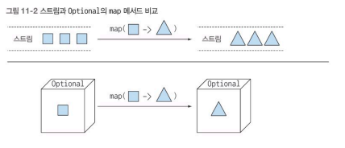
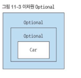
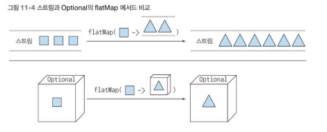
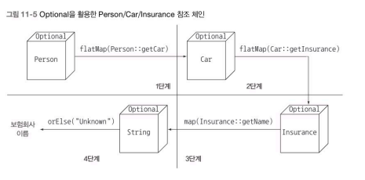
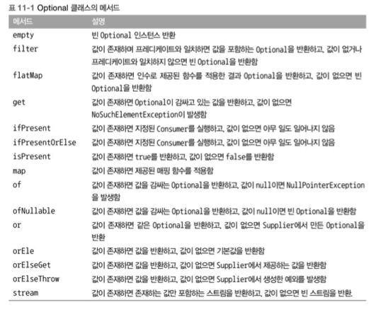

# Chapter 11 - null 대신 Optional 클래스


### 11.1 값이 없는 상황을 어떻게 처리할까?

```java
public class Person {
    private Car car;
  public Car getCar() {
    return car;
  }
}

public class Car {
  private Optional<Insurance> insurance;
  public Optional<Insurance> getInsurance() {
    return insurance;
  }
}

public class Insurance {
  private String name;
  public String getName() {
    return name;
  }
}
```

```java
public String getCarInsuranceName(Person person) {
    return person.getCar().getInsurance().getName();
 }
```

Person이 null인 경우, getInsurance가  null인 경우 NullPointerException 발생 

**11.1 보수적인 자세로 NullPointerException 줄이기**

```java
public String getCarInsuranceName(Person person) {
    if (person != null) {
      CarV1 car = person.getCar();
      if (car != null) {
        Insurance insurance = car.getInsurance();
        if (insurance != null) {
          return insurance.getName();
        }
      }
    }
    return "Unknown";
 }
```

null확인 코드 때문에 나머지 호출 체인의 들여쓰기 수준이 증가한다. 

이와 같은 반복 패턴 코드를 ‘깊은 의심’이라고 부른다. 이를 반복하다보면 코드의 구조가 엉망이 되고 가독성도 떨어진다. 

```java
public String getCarInsuranceName(Person person) {
    if (person == null) {
      return "Unknown";//null 확인 코드마다 출구가 생긴다. 
    }
    CarV1 car = person.getCar();
    if (car == null) {
      return "Unknown";
    }
    Insurance insurance = car.getInsurance();
    if (insurance == null) {
      return "Unknown";
    }
    return insurance.getName();
  }
```

null 변수가 있으면 즉시 "Unknown" 반환

네 개의 출구가 생겼기 때문에 유지보수가 어려워진다. 같은 문자열을 반복하면서 오타 등의 실수가 생길 수도 있다. 

null로 값이 없다는 사실을 표현하는 것은 좋은 방법이 아니다. 따라서 값이 있거나 있음을 표현할 수 있는 좋은 방법이 필요하다. 

**11.1.2 null 때문에 발생하는 문제**

- 에러의 근원이다: NullPointerException은 자바에서 가장 흔히 발생하는 에러이다.
- 코드를 어지럽힌다: 중첩된 null 확인 코드를 추가해야 하므로 가독성이 떨어진다.
- 아무 의미가 없다: null은 아무 의미도 표현하지 않는다. 특히 정적 형식 언어에서 값이 없음을 표현하는 방법으로는 적절하지 않다.
- 자바 철학에 위배된다: 자바는 개발자로부터 모든 포인터를 숨겼다. 하지만 예외가 있는데 그것이 바로 null 포인터다.
- 형식 시스템에 구멍을 만든다: null은 무형식이며 정보를 포함하고 있지 않으므로 모든 참조 형식에 null을 할당할 수 있다. 이런 식으로 null이 할당되기 시작하면서 시스템의 다른 부분으로 null이 퍼졌을 때 애초에 null이 어떤의미로 사용되었는지 알 수 없다.

**11.1.3 다른 언어는 null 대신 무얼 사용하나?**

최신 그룹 같은 언어에서는 안전 내비게이션 연산자(?.)를 도입해서 null문제를 해결. 

```groovy
def carInsuranceName = person?.car?.insurance?.name
```

안전 내비게이션 연산자를 이용하면 null 참조 예외 걱정 없이 객체에 접근할 수 있다. 

하스켈, 스칼라 등의 함수형 언어는 아예 다른 관점에서 null문제를 접근한다. 하스켈은 선택형값을 저장할 수 있는 Maybe라는 형식을 제공한다. Maybe는 주어진 형식의 값을 갖거나 아니면 아무 값도 갖지 않을 수 있다. 따라서 null 참조 개념은 자연스럽게 사라자니다. 스칼라도 T형식의 값을 갖거나 아무 값도 갖지 않을 수 있는 Option[T]라는 구조를 제공한다. 

자바8에서는 java.util.Optional<T>라는 새로운 클래스를 제공한다. 

### 11.2 Optional 클래스 소개

Optional은 선택형값을 캡슐화하는 클래스다. 

값이 있으면 Optional 클래스는 값을 감싼다. 반면 값이 없으면 Optional.empty 메서드로 Optional을 반환한다. 



```java
public class Person {
  private Optional<Car> car;//사람이 차를 소유했을 수도, 소유하지 않았을 수도 있으므로 Optional로 정의 
  private int age;
  public Optional<Car> getCar() {
    return car;
  }
  public int getAge() {
    return age;
  }
}

public class Car {
  private Optional<Insurance> insurance;//자동차가 보험에 가입되어 있을 수도 가입되어 있지 않았을 수도 있으므로 Optional로 정의한다. 
  public Optional<Insurance> getInsurance() {
    return insurance;
  }
}

public class Insurance {
  private String name;//보험회사에는 반드시 이름이 있다. 
  public String getName() {
    return name;
  }

}
```

Optional 클래스를 사용하면서 모델의 의미가 더 명확해졌음을 확인할 수 있음 

Optional을 이용하면 값이 없는 상황이 우리 데이터에 문제가 있는 것인지 아니면 알고리즘의 버그인지 명확하게 구분할 수 있다. 모든 null 참조를 Optional로 대치하는 것은 바람직하지 않다. Optional의 역할은 더 이해하기 쉬운 API를 설계하도록 돕는 것이다. 

### Optional 적용 패턴

**11.3.1 Optional 객체 만들기**

- 빈 Optional

정적 팩토리 메서드 Optional.empty로 빈 Optional 객체를 얻을 수 있다. 

- null이 아닌 값으로 Optional 만들기

Optional.of로 null이 아닌 값을 포함하는 Optional을 만들 수 있다. 

```java
Optional<Car> optCar = Optional.ofNullable(car);
```

이제 car가 null이라면 즉시 NullPointerException을 발생 

- null값으로 Optional 만들기

```java
Optional<Car> optCar=Optional.ofNullable(car);
```

**11.3.2 맵으로 Optional의 값을 추출하고 변환하기** 

```java
Optional<Insurance> optInsurance = Optional.ofNullable(insurance);
Optional<String> name = optInsurance.map(Insurance::getName)
```

Optional이 값을 포함하면 map의 인수로 제공된 함수가 값을 바꾼다. Optional이 비어있으면 아무 일도 일어나지 않는다. 



```java
public String getCarInsuranceName(Person person) {
  return person.getCar().getInsurance().getName();
}
```

**11.3.3 flatMap으로 Optional 객체 연결** 

```java
Optional<Person> optPerson = Optional.of(person);//Optional<Peopel>반환
Optional<String> name = 
                optPerson.map(Person::getCar)//Optional<Optional<Car>>반환
        .map(Car::getInsurance)
        .map(Insurance::getName);
```





flatMap 메서드로 전달된 함수는 각각의 정사각형을 두 개의 삼각형을 포함하는 스트림으로 변환한다. 즉, map을 적용한 결과로 세 개의 스트림(각각 두개의 삼각형을 가지고 있는)을 포함하는 하나의 스트림이 생성된다. 하지만 flatMap 덕분에 이차원 스트림이 여섯개의 삼각형을 포함하는 일차원 스트림으로 바뀐다. 마찬가지로 Optional의 flatMap 메서드로 전달된 함수는 Optional에 저장된 정사각형을 Optional에 저장된 삼각형으로 바꾼다. map 메서드 였다면 Optional 내부에 다른 Optional 그리고 그 내부에 삼각형이 저장되었겠지만 flatMap 메서드 덕분에 이차원 Optional이 하나의 삼각형을 포함하는 하나의 Optional로 바뀐다. 

**Optional로 자동차의 보험회사 이름 짓기** 

```java
public String getCarInsuranceName(Optional<Person> person) {
    return person.flatMap(Person::getCar)
        .flatMap(Car::getInsurance)
        .map(Insurance::getName)
        .orElse("Unknown");//결과 Optional이 비어있으면 기본값 사용 
}
```

 null을 확인하느라 조건 분기문을 추가해서 코드를 복잡하게 만들지 않으면서 쉽게 이해할 수 있는 코드

도메인 모델과 관련한 암묵적인 지식에 의존하지 않고 명시적으로 형식 시스템을 정의할 수 있다. 

**Optional을 이용한 Person/Car/Insurance 참조 체인**



우선 Person을 Optional로 감싼 다음에 flatMap(Person::getCar)을 호출했다. 

첫번째 단계에서는 Optional 내부의 Person에 Fucntion을 적용한다. 여기서는 Person의 getCar 메서드가 Fucntion이다. getCar 메서드는 Optional<Car>를 반환하므로 Optional 내부의 Person이 Optional<Car>로 변환되면서 중첩 Optional이 생성된다. 따라서 flatMap으로 Optional을 평준화한다. 

두번째 단계에서도 첫번째와 비슷하게 Optional<Car>을 Optional<Insurance>로 변환한다.

세번째 단계에서는 Optional<Insurance>를 Optional<String>으로 변환한다. 세번째에서 Insurance.getName()은 String을 반환하므로 flatMap을 사용할 필요가 없다. 

**11.3.4 Optional 스트림 조작**

자바 9에서는 Optional을 포함하는 스트림을 쉽게 처리할 수 있도록 Optional에 stream() 메서드를 추가하였다. 

```java
public Set<String> getCarInsuranceNames(List<Person> persons) {
    return persons.stream()
        .map(Person::getCar)//사람 목록을 각 사람이 보유한 자동차의 Optional<Car> 스트림으로 변환
        .map(optCar -> optCar.flatMap(Car::getInsurance))//FlatMap 연산을 이용해 Optional<Car>을 해당 Optional<Insurance>로 변환
        .map(optInsurance -> optInsurance.map(Insurance::getName))//Optional<Insurance>를 해당 이름의 Optional<String>으로 매핑
        .flatMap(Optional::stream)//Stream<Optional<String>>을 현재 이름을 포함하는 Stream<String>으로 변환
        .collect(toSet());//결과 문자열을 중복되지 않은 값을 갖도록 집합으로 수집 
  }
```

세번의 변환 과정을 거친 결과 Stream<Optional<String>>를 얻는데 사람이 차를 갖고 있지 않거나 또는 차가 보험에 가입되어 있지 않아 결과가 비어 있을 수 있다. Optional 덕분에 이런 종류의 연산을 널 걱정없이 안전하게 처리할 수 있지만 마지막 결과를 얻으려면 빈 Optional을 제거하고 값을 언랩해야 한다는 문제가 있다. 

**11.3.5 디폴트 액션과 Optional 언랩**

- get()은 값을 읽는 가장 간단한 메서드면서 동시에 가장 안전하지 않은 메서드다. 메서드 get은 래핑된 값이 있으면 해당 값을 반환하고 값이 없으면 NoSuchElementException을 발생시킨다. 따라서 Optional에 값이 반드시 있다고 가정할 수 있는 상황이 아니면 get 메서드를 사용하지 않는 것이 바람직하다.
- orElse() 메서드를 이용하면 Optional이 값을 포함하지 않을 때 기본값을 제공할 수 있다.
- orElse(Supplier<? extends T> other)는 orElse 메서드에 대응하는 게으른 버전의 메서드다. Optional에 값이 없을 때만 Supplier가 실행되기 때문이다. 디폴트 메서드를 만드는데 시간이 걸리거나(효율성 때문에) Optional이 비어있을 때만 기본값을 생성하고 싶다면(기본값이 반드시 필요한 상황) orElseGet<Supplier<? extends T> other)를 사용해야 한다.
- orElseThrow(Supplier<? extends X> exceptionSupplier)는 Optional이 비어있을 때 예외를 발생시킨다는 점에서 get 메서드와 비슷하다. 하지만 이 메서드는 발생시킬 예외의 종류를 선택할 수 있다.
- ifPresent(Consumer<? super T> consuemr)를 이용하면 값이 존재할 때 인수로 넘겨준 동작을 실행할 수 있다. 값이 없으면 아무 일도 일어나지 않는다.
- ifPresentOrElse(Consumer <? super T> action, Runnable emptyAction) 메서드는 Optional이 비었을 때 실행할 수 있는 Runnable을 인수로 받는다는 점만 ifPresent와 다르다.

**11.3.6 두 Optional 합치기**

```java
public Optional<Insurance> nullSafeFindCheapestInsurance(Optional<Person> person, Optional<Car> car) {
    if (person.isPresent() && car.isPresent()) {
      return Optional.of(findCheapestInsurance(person.get(), car.get()));
    } else {
      return Optional.empty();
    }
  }
```

Person 과 Car 정보를 이용해서 가장 저렴한 보험료를 제공하는 보험회사를 찾는 복잡한 비즈니스 로직을 구현 

이 메서드는 person과 car의 시그니처만으로 둘 다 아무 값도 반환하지 않을 수 있다는 정보를 명시적으로 보여준다

**11.3.7 필터로 특정값 거르기**

```java
Optional<Insurance> optInsurance= ...;
optInsurance.filter(insurance->
                                "CambridegeInsurance".equals(insurance.getName()))
                                .ifPresent(x->System.out.println("ok"));
```

Optional이 비어있다면 filter은 아무동작도 하지 않음. Optional에 값이 있으면 그 값이 프레디케이트를 적용한다. 




**11.4.1. 잠재적으로 null이 될 수 있는 대상을 Optional로 감싸기**

```java
Optional<Object> value= Optional.ofNullable(map.get("key")); ****
```

**11.4.2 예외와 Optional 클래스**

Interger.parseInt(String)메서드는 문자열을 정수로 바꾸지 못할 때 NumberFormatException을 발생시킨다. 

정수로 변환할 수 없는 문자열 문제를 빈 Optional로 해결할 수 있다. 

```java
public static Optional<Integer> stringToInt(string s){
    try{
            return Optional.of(Integer.parseInt(s));//문자열을 정수로 변환할 수 있으면 정수로 변환된 값을 포함하는 Optional을 반환한다. 
    }catch(NumberFormatException e){
            return Optional.empty();//그렇지 않으면 빈 Optional을 반환한다. 
    }
}
```

**11.4.3 기본형 Optional을 사용하지 말아야 하는 이유**

스트림처럼 Optional도 OptionalInt, OptionalLong, OptionalDouble 등의 클래스를 제공한다. 

하지만 Optional의 최대 요소 수는 한개이므로 Optional에서는 기본형 특화 클래스로 성능을 개선할 수 없다. 

기본형 특화 Optional은 map, flatMap, filter 등을 지원하지 않으므로 기본형 특화 Optional을 사용할 것을 권장하지 않는다. 

**11.4.4 응용** 

```java
Properties props = new Properties();
props.setProperty("a", "5");
props.setProperty("b", "true");
props.setProperty("c", "-3");
//프로그램 설정 인수로 Properties를 전달한다고 가정 

assertEquals(5, readDurationImperative(props, "a"));
assertEquals(0, readDurationImperative(props, "b"));
assertEquals(0, readDurationImperative(props, "c"));
assertEquals(0, readDurationImperative(props, "d"));
//프로퍼티 a는 양수로 변환할 수 있는 문자열을 포함하므로 5를 반환
//프로퍼티 b는 숫자로 반환할 수 없는 문자열을 포함하므로 0을 반환 ...

public static int readDuration(Properties props, String name) {
    String value = props.getProperty(name);
    if (value != null) {//요청한 이름에 해당하는 프로퍼티가 존재하는지 확인
      try {
        int i = Integer.parseInt(value);//문자열 프로퍼티를 숫자로 변환하기 위해 시도
        if (i > 0) {//결과 숫자가 양수인지 확인
          return i;
        }
      } catch (NumberFormatException nfe) { }
    }
    return 0;//하나의 조건이라도 실패하면 0반환 
}
```